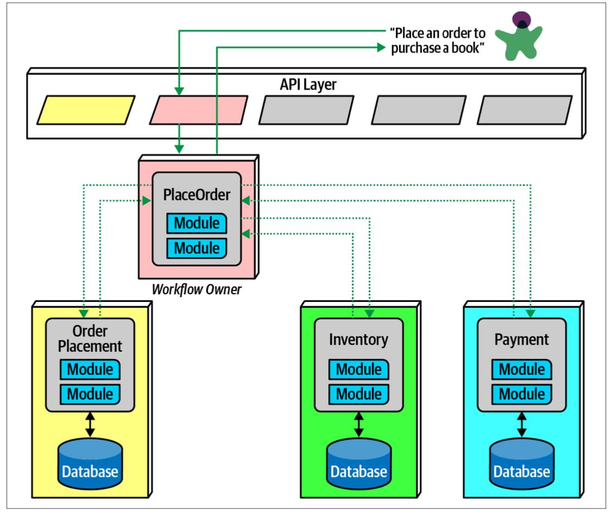

# FSA
## Part 2. Architecture Styles - 17. Microservices Architecture
- microservice 는 DDD 의 영향을 많이 받음
- 특히 bounded context 라는 개념. 이는 decoupling style 을 의미
  - developer 가 domain 을 정의할 때, domain 은 many entities, behaviors, code and database schemas 등을 포함
  - reuse 와 trade-off 관계
- microservice 는 아래 그림과 같은 모습
- Architect 는 각 service 들이 작동하기 위해 필요한 것들을 포함하도록 설계

### Distributed
- microservice 는 distributed architecture 의 모습
- 각 service 는 각자의 process (virtual machine, container) 에서 실행
- 이런 형태는 sharing 할 때의 단점을 많이 보완
- 물론 trade-off 로 performance 적인 단점도 존재

### Bounded Context
- service 들이 실행하기에 필요한 것들이 다 포함

### Granularity
- 얼마나 세분화할지, service 의 범위를 어떻게 할지 한번에 정하기는 어려움
- 고려사항
  - 각 service 는 functionally cohesive
  - communication overhead 가 발생하면 더 큰 service 를 고려

### Data Isolation
- single db 를 사용하지 않고 각 service 마다 적절한 tool 을 사용할 수 있음
- 또한, 서로 영향도 줄어드는 장점이 있음

### API Layer
- 많은 microservice 에서 system 의 consumer 사이에 API layer 가 존재
- 하지만 API layer 가 mediator, orchestration tool 로 사용되지 않는게 좋음

### Operational Reuse
- coupling 보다 duplication 을 좋아하는 microservice 에서는 그렇다면 coupling 의 형태가 더 좋을 수 있는 경우?
  - 서비스마다 공통적으로 사용되는 경우
  - 예) 모니러팅, 로깅
- 먼저 아래 그림처럼 sidecar pattern 을 이용가능
  - sidecar pattern: 어플리케이션과 독립적으로 동작하는 별도의 component 를 붙이는 형태

- 또 다른 방법으로는 unified control 을 하는 service mesh 를 만드는 아래와 같은 형태도 있음

### Communication
- service 가 decoupled 상태를 잘 유지하면서 함께 잘 작동하기 위해서 communication 방식이 중요
- 동기, 비동기로 구분
- architect 는 이 부분에 대해서 protocol-aware heterogeneous interoperability 를 생각해야 함
  - protocol-aware: service 서로 통신하는 방법을 알아야 함
  - heterogeneous: 분산아키텍처이기에 각기 다른 기술스택을 갖고 있는 상황에서도 잘 작동해야함
  - interoperability: service 끼리 잘 작동해야 함

### Choreography and Orchestration
- Choreograph pattern 은 event-driven 형태와 같은 communication style 을 가짐
- 아래 그림처럼 decopled 하고 central coordinator 가 없음

- 하지만 항상 그렇듯 완벽한 방법은 아님
- 아래처럼 복잡한 경우 error handling 이나 coordination 이 어려워질 수 있음
- 아래같이 첫번째 service 가 해당 domain 의 역할도 하면서 mediator 의 역할로 coordinate 하는 패턴을 front controller pattern 이라고 함

- 그런 경우 아래와 같이 orchestraion 을 사용하는 것도 방법
- 아래 그림은 localized mediator 를 사용한 모습

### Transactions and Sagas
- microservice 에서 service 들 간의 transactional coordination 을 어떻게 해야할지 고민되면 하지 않고 granularity 를 수정하는 것을 추천
- 하지만 해야하는 상황이 발생한다면 아래 그림과 같이 할 수 있고 이를 saga pattern 이라고 함
  - service 는 여러개의 service call 들간의 mediator 역할을 하고 transaction 을 coordinate 함

# BM
## Ch 1 (Part 1. Foundation - 1. What Are Microservices?)

### Key Concepts of Microservices
- Independent Deployability
  - decoupled 한 상태 덕분에 다른 service 와 독립적으로 배포가 가능
- Modeled Around a Business Domain
  - business domain 을 기반으로 service 를 설계하기에 새로운 기능이나 복잡한 기능을 제공하기 쉬워짐
- Owning Their Own State
  - encapsulate user interface (UI), business logic, and data
- Size
  - 상황에 따라 달라지기 때문에 너무 크기에 집착할 필요없음
  - 대신 현재 상황에 잘 파악해서 얼마나 microservice 를 감당할 수 있는지 판단해야함
- Flexibility
  - microservices buy you options (organizational, technical, scale, robustness)

### Monolith
- The Single-Process Monolith
  - 코드들이 single process 에서 돌아가는 형태
  - 작은 organization 에서는 문제가 없으나 크기가 커지만 moular monolith 형태로 바뀜
- The Modular Monolith
  - single-process monolith 의 한 종류
  - single-process 가 여러 개의 module 로 나누어져 있고 독립적으로 작동 가능, 단 전체 서비스를 위해서는 다 필요
  - 잘 만들어지면 microservice 까지 가지 않더라고 parallel 한 작업 등의 장점 가능
  - 단점은 database 의 decomposition 이 잘 안되는 경우가 있음
- The Distributed Monolith
  - 다양한 service 이루어져있지만 전체 system 의 측면에서 보면 다 같이 배포되야하는 형태
  - distributed system, monolith 의 단점을 모두 가지고 있음

#### Monoliths and Delivery Contention
- 팀의 규모가 커질수록 동시에 같은 기능을 수정하기도 하고 누가 이 코드라인의 책임자인지 파악하기 어려워지는 경우 존재
- microservice 는 이에 대한 해답이 될 수 있음

#### Advantages of Monoliths
- distributed system 이 가지는 단점이 없고 간단함
- 개발, 모니터링, 트러블슈팅 등 모두 간단한 편
- monoliths 가 절대 legacy 이거나 단점이 아님
- 상황에 따라 다르게 사용해야할 뿐

### Advantages of Microservices
- Technology Heterogeneity
  - service 마다 다양한 기술을 사용할 수 있음
  - 새로운 기술 적용, 업데이트 등이 용이함
- Robustness
  - 특정 부분에서 failure 가 발생해도 전체 system의 failure 를 막기 용이함
- Scaling
  - monolith 도 scale 을 조절하기 어렵지 않지만 특정 service 만 scale 조절하기는 어려움 (전체 다 적용 필요)
  - microservice 는 가능
- Ease of Deployment
  - 다른 service 와 독립적으로 배로, 롤백하기 편리함
- Organizational Alignment
  - 하나의 서비스에 모든 조직이 alingn 되어있지 않아서 productive 함
  - architecture and organization 간의 alignment 를 유지하기 용이함
- Composability

### Microservice Pain Points
- Developer Experience
- Technology Overload
- Cost
  - microservice 를 통해 more profit 은 맞을 수 있어도 reduce cost 는 아닐 확률이 높음
  - 더 많은 컴퓨팅 리소스가 필요하고 근시일에는 조직의 업무 진행 속도도 느려질 수 있음
- Reporting
  - database 도 분산되어 있기에 report 가 어려움
- Monitoring and Troubleshooting
- Security
- Testing
- Latency
- Data Consistency

## Ch 3 (Part 1. Foundation - 3. Splitting the Monolith)

- Have a Goal
  - microservice 자체가 목표가 되서는 안됨
- Incremental Migration
  - monolith 을 나누려면 조금씩 시작
- The Monolith Is Rarely the Enemy
  - monolith 를 무조건 좋지 않다고 생각하면 안됨
  - 많은 system 이 한번에 monolith 가 되기 어렵고 될 필요가 없는 경우도 많음
- The Dangers of Premature Decomposition
  - 해당 system domain 에 대한 이해도가 부족하면 함부로 split 하지 마라

### What to Split First?
- split 하려고 할때 microservice 로 extraction 이 얼마나 쉬울지 또는 extract 시 얻는 이점이 얼마나 클지 고민
- 처음에는 쉬움에 좀 더 초점을 맞추고 점차 이점이 큰 부분으로 이동하길 추천

### Decomposition by Layer
- Code First
  - short-term benefit 을 주고 좀 더 쉬움
  - 그래서 data 보다 먼저 decompose 하는 경우가 많음
- Data First
  - data extraction 이 가능한게 확실하지 않을때는 먼저 진행하면 좋음

### Useful Decompositional Patterns
- Strangler Fig Pattern
  - 마틴파울러가 호주에서 본 식물에서 이름 기원
    - 다른 나무에 기생하여 자라고 점차 기존에 있던 나무를 죽여가는 식물
  - 점차 microservice 의 형태로 바꿈
  - 기존 system 을 그냥 두고 새로운 system 개발하여 점차 덮어씌우는 패턴
  - 아래 그림과 같이 진행되기에 monolithic application 을 바꿀 필요가 없는 장점 존재

- Parallel Run
  - 개발한 system 으로 migrate 할 때, risky 하다면 같은 request 를 parallel 하게 처리하도록 해서 결과를 비교
- Feature Toggle
  - 두 개의 system 에 대해서 switch off, on 을 할 수 있는 mechanism 을 의미

### Data Decomposiion Concerns
- Performance
  - monolithic 한 상황에서 (관계형) database 끼리의 join 은 빠름
  - 하지만 microservice 의 경우 service 마다 database 가 나누어져 있고 이들을 join 하귀 위해서는 한쪽으로 fetch 헤야하고 data 부분이 아니라 app 부분에서 join 을 진행해야해서 느림
- Data Integrity
  - data integrity 저하 가능성 존재
- Transactions
- Tooling
  - database 는 수정, 리팩토링을 하기 좋은 tool 들이 적음
- Reporting Database
  - database 에 대한 직접적인 접근을 하지 않도록 숨기고 좋은 interface 를 만들 수 있음
  - 하지만 어떤한 이유에서 restapi 등을 통한 접근보다 바로 접근하는게 필요할 수 도 있는데 이게 어려워질 수 있음
  - reporting database 은 외부에서 접근이 가능한 database 이고 microservice 의 internal storage 에서 데이터를 넣어줌
    - 이때 그대로 internal 정보를 넣는게 아니라 필요한 것만 넣어야 함
    - reporting database 도 다른 microservice endpoint 처럼 microservice 담당자가 잘 유지보수해야 함