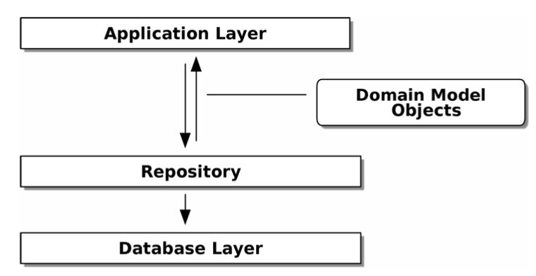
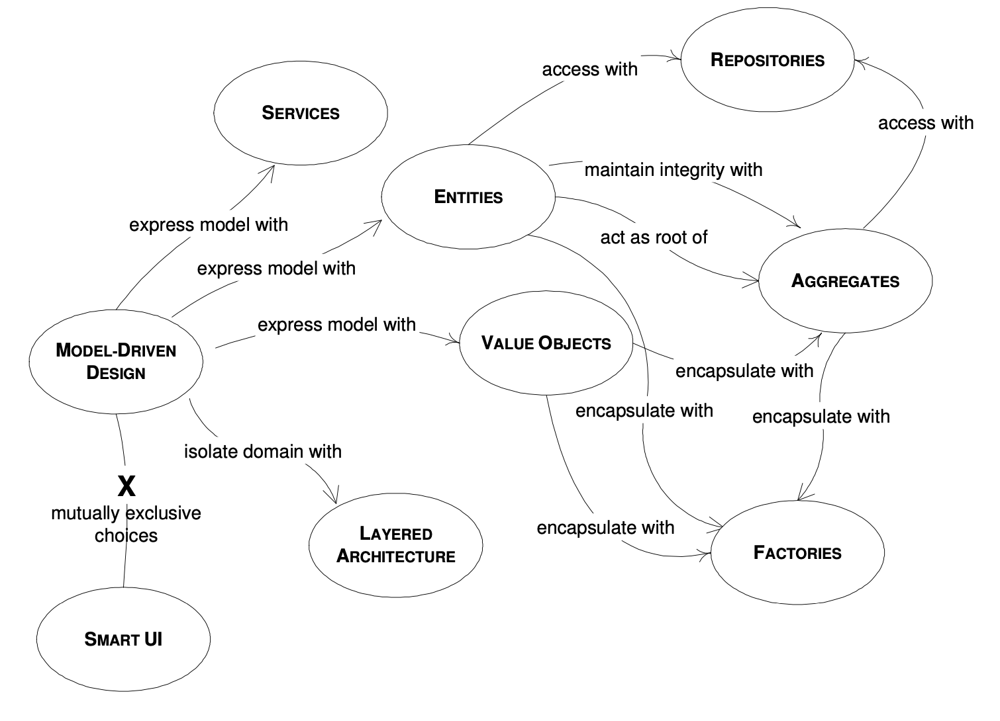

# AAP
## Part1. Building an Architecture to Support Domain Modeling - Ch1. Domain Modeling
- domain: 우리가 해결하려고 하는 문제를 의미 (구매, 배달 등등)
- model: 어떤 프로세스에 대한 설명서, 매커니즘 이라고 할 수 있음
- Value Object: any domain object that is identified only by its data and doesn’t have a long-lived identity
  - Python 에서는 `dataclass` 를 이용하면 좋음

```python
@dataclass(frozen=True)
class OrderLine:
  orderid: OrderReference
  sku: ProductReference
  qty: Quantity
```

- Entity: domain object that has long-lived identity

## Part1. Building an Architecture to Support Domain Modeling - Ch2. Repository Pattern
### ORM
- ORM 을 통해 persistence ignorance 를 얻을 수 있음
  - domain model 의 입장에서 db에 어떻게 data 가 저장되고 유지되는지 알 필요없음

### Repository Pattern


- inverting the dependency
  - domain model 은 db, infra 에 대해 dependency 가 없도록 하고
  - 아래 코드처럼 domain model 을 import 해서 mapping 해서 사용가능

```python
from sqlalchemy.orm import mapper, relationship
import model

metadata = MetaData()
order_lines = Table(
    'order_lines', metadata,
    Column('id', Integer, primary_key=True, autoincrement=True),
    Column('sku', String(255)),
    Column('qty', Integer, nullable=False),
    Column('orderid', String(255)),
)

def start_mappers():
  lines_mapper = mapper(model.OrderLine, order_lines)
```

- repository pattern 은 permanant storage (db) 에 대한 abstraction
  - sql 문을 직접 다루지 않고 추상화된 클래스, 함수들을 이용
  - 마치 in-memory 에 data 가 있는 것처럼 사용
  - 추가적으로 fake repository 를 만들어서 test 하기도 용이
    - abstraction 을 안하면 fake 사용에 제한

## Part1. Building an Architecture to Support Domain Modeling - Ch3. A Brief Interlude: On Coupling and Abstractions
## Part1. Building an Architecture to Support Domain Modeling - Ch4. Our First Use Case: Flask API and Service Layer
## Part1. Building an Architecture to Support Domain Modeling - Ch5. TDD in High Gear and Low Gear

# BM
## Part 1. Foundation - Ch 2. How to Model Microservices
### What Makes a Good Microservice Boundary?
#### information hiding
- a desire to hide as many details as possible behind a module (or, in our case, microservice) boundary
- module 의 이점
  - improved development time
  - comprehensibility
  - flexibility

#### cohesion
- the code that changes together, stays together
- 같은 역할을 하는 것끼리 모이기

#### coupling
- microservice는 하나의 service 의 변화, 배포가 있을때 system 의 다른 부분의 변화가 필요하지 않도록 하는게 목표
- loosely coupled service 는 service 간의 call 을 최소화하고 연결되어 있는 service 들에 대해 알아야하는 정보가 적음

### Types of Coupling
- Domain Coupling
  - 하나의 microservice 가 다른 microservice 의 기능이 필요해서 interact 하는 것
  - 이또한 최소화하려고 하지만 피할 수 없음
- Pass-Through Coupling
  - 하나의 microservice 가 다른 microservice 에게 필요한 data 를 전달하는 것
  - 이런 경우 전달과정에서 다른 microservice 들이 많아지면 문제가 많이질 수 있음
- Common Coupling
  - 2개 이상의 microservice 들이 같은 data 를 공유하는 형태 (shared)
  - 따라서 data 의 변동이 생기면 여러 service 에 영향을 줌, 여러 service 가 data 에 충돌이 발생할 수 있는 요청을 줌
  - 이에 대한 해결책으로 data
- Content Coupling
  - upstream service 가 downstream service 의 internal state (주로 db 같은) 를 바꾸는 형태

### Just Enough Domain-Driven Design
- DDD 의 core concept 3가지

#### ubiquitours language
- Defining and adopting a common language to be used in code and in describing the domain, to aid communication
- user 들이 사용하는 용어와 개발코드가 동일하면 편함

#### aggregate
- A collection of objects that are managed as a single entity, typically referring to real-world concepts
- a representation of a real domain concept

#### Bounded Context
- An explicit boundary within a business domain that provides functionality to the wider system but that also hides complexity
- 서로 다른 context 에서 share 하는 부분도 context 내부에서는 다르게 사용되거나 내부의 정보가 모두 share 되지 않는 경우가 있음

### The Case for Domain-Driven Design for Microservices

### Alternatives to Business Domain Boundaies
- DDD 는 microservice 를 만드는데 아주 유용하지만 DDD 뿐만 아니라 고려하면 좋을 내용들이 더 있음
#### Volatility (변동성)
- volatility-based decomposition 이 항상 좋은 것은 아님
- market 에 빠르게 대응해야하고 자주 바뀌는 경우
#### Data
- 주로 privacy, security 관련한 이유로 data 의 특징에 따라 나누어질 수 있음
#### Technology
- 사용하는 기술들의 특징, 상황에 따라 boundary 가 만들어 질 수 있음
#### Organizational
- 조직의 상황에 따라 달라질 수 있음

### Mixing Models and Exceptions
- 하나의 목표를 갖고 시스템을 구현하기 보다 위처럼 다양한 기준, 상황을 고려할 필요가 있음

# DDDQ
- DDD 의 주요 개념들의 관계도
