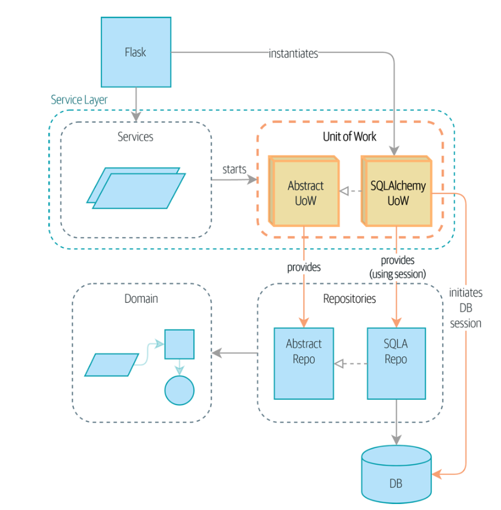
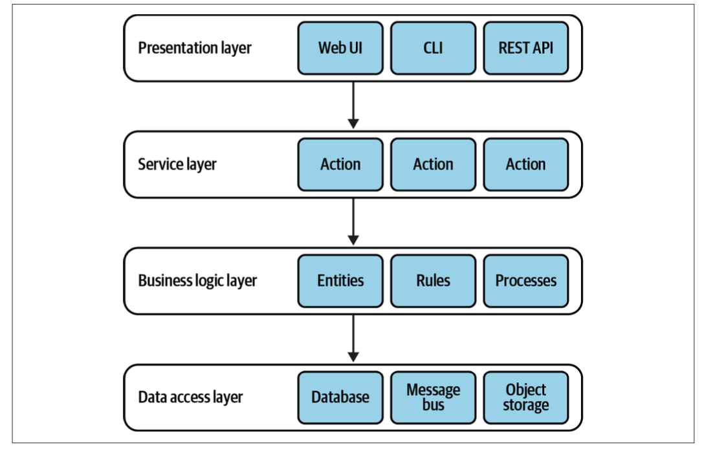
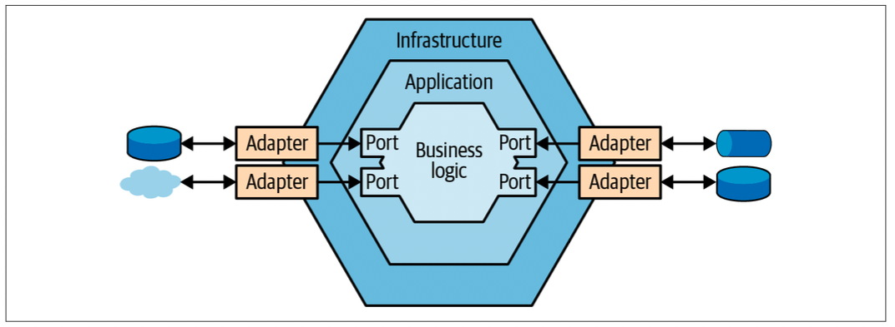
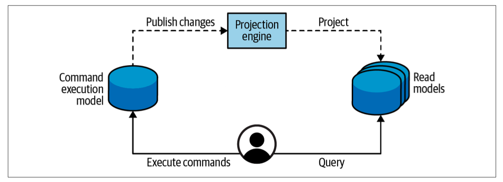

# Unit of work
## APP Ch 6 Unit of Work Pattern (Part1. Building an Architecture to Support Domain Modeling) 
- service layer 와 data layer 를 더 decouple 할 수 있다.
- Flask 가 직접 db 와 이야기할 필요가 없다.


# Aggregate
## LDDD Ch 6 Tackling Complex Business Logic (Part 2. Tactical Design)
- domain model 이 이루는 것들에 대해 알아보자.
#### value object
  - object 가 갖고 있는 value 를 통해 identified 되는 것이다.
  - immutable
  - value object 만으로 business logic 을 담고 있게 할 수 있다.
  - domain 의 element (다른 object 들의 특징을 담고 있는) 로 사용된다.
- ubiquitous language
  - 코드만 봐도 어떤 로직이고 무엇을 의미하는지 이해할 수 있게 된다.
  - value object 를 통해 이를 잘 표현할 수 있다.
#### Entities
- value object 와 다르게 명확한 identification field 가 있다.
- not immutable
#### Aggregates
- entity 처럼 명확한 identification 이 있고 mutable 하다.
- mutable 하기에 오염될 수 있다. consistency 를 위해서 state 에 대한 변경을 aggregates' business logic 에서만 가능하게 한다. (구현 관점에서)

```java
public class Ticket {
...
  public void AddMessage(UserId from, string body) {
    var message = new Message(from, body);
                _messages.Append(message);
        } 
... }
```
- Hierarchy of entities
  - value object 와 entity 들로 aggregate 를 구성한다. 그 형태가 hierarchy 한 형태인 경우가 많다.
- Transaction boundary
  - Transaction? 데이터베이스의 상태를 변화시키기 위해 수행하는 작업의 논리적 단위, 최소 단위라고 하는 글도 있다.
  - aggregate 는 transactional boundary 역할도 할 수 있다. 아니 할 수 있게 구현해야 한다.
- Referencing other aggregates
  - aggregate 에 있는 object 들은 같은 transactional boundary 에 속하기 때문에 aggregate 가 너무 크지 않게 개발해야한다.
  - aggregate의 bussiness 역할에 consistent 한 data 들이 있어야한다.
- The aggregate root
  - root 라고 할 수 있는 interface 가 존재한다. 이들을 거쳐서 작업들이 일어난다.
  - 또 다른 형태는 domain events 가 있다.

#### Domain service
- aggregate, value object 에 속하지 않는 business logic 이 있을 수 있다. 또는 여러개의 aggregate 를 처리해야하는 경우 domain service 를 구현한다.
- domain service? stateless object that implements the business logic

## LDDD Ch 7 Modeling the Dimension of Time (Part 2. Tactical Design)
- event-sourced domain model
  - domain model pattern 과 거의 유사
  - 구현시 크게 다른 점은 aggregate 의 state 가 유지되는 것이 아니라 event 에 따라 생성된다는 점

### Event Sourcing
- event sourcing pattern
  - the dimension of time 을 data model 에 넣어서 사용
  - 단순히 aggregate의 현재 state 를 schema 에 반영하는 것만 하지 않음, aggregate 의 변화를 기록
  - 예를 들어, 어떤 유저가 첫 상품을 구매할 때 그전에 어떤 event 들이 있었는지 기록함, 단순히 구매했다는 state 만 사용하는게 아님

```java
public class LeadSearchModelProjection {
  public long LeadId { get; private set; }
  public HashSet<string> FirstNames { get; private set; }
  public HashSet<string> LastNames { get; private set; }
  public HashSet<PhoneNumber> PhoneNumbers { get; private set; }
  public int Version { get; private set; }

  public void Apply(LeadInitialized @event) {
    LeadId = @event.LeadId;
    FirstNames = new HashSet<string>();
    LastNames = new HashSet<string>();
    PhoneNumbers = new HashSet<PhoneNumber>();
    FirstNames.Add(@event.FirstName);
    LastNames.Add(@event.LastName);
    PhoneNumbers.Add(@event.PhoneNumber); Version = 0;
  }
  
  public void Apply(ContactDetailsChanged @event) {
    FirstNames.Add(@event.FirstName);
    LastNames.Add(@event.LastName);
    PhoneNumbers.Add(@event.PhoneNumber);
    Version += 1;
  }
  ...
}
```

- analysis-friendly representation

```java
public class AnalysisModelProjection {
  public long LeadId { get; private set; }
  public int Followups { get; private set; }
  public LeadStatus Status { get; private set; }
  public int Version { get; private set; }

  public void Apply(LeadInitialized @event) {
            LeadId = @event.LeadId;
            Followups = 0;
            Status = LeadStatus.NEW_LEAD;
            Version = 0;
  }
  public void Apply(Contacted @event) {
              Version += 1;
          }
  ...
}
```
- 위에서 본 코드 예시들은 search-optimized, analysis-optimized in-memory model 이다. 이들을 database 에 적용하는 것도 구현해야하는데 chap8에서 CQRS를 통해 알아보자.

- Source of Truth
  - object's state 의 모든 변화는 event 라고 한다.
  - event 들이 db 에 저장이 되면 이는 system's source of truth 가 된다.
  - 이때 db 를 event store 라고 부른다.

- Event Store
  - event 가 저장되면 수정, 삭제를 하지 않는다.

### Event-Sourced Domain Model
- event-sourced aggregate 의 연산은 다음과 같다.
  1. aggregate's domain events 를 가져온다.
  2. events 를 state representation 에 반영한다.
  3. aggregate's command 를 통해 business logic 을 실행하고 새로운 domain events 를 생성한다.
  4. 새로운 domain events 를 event store 에 저장한다.
- 장점
  - Time traveling
    - 과거 state 를 restore 할 수 있다.
  - Deep insight
    - system 의 state, behavior 등에 대한 deep insight 를 알 수 있다.
  - Audit log
  - Advanced optimistic concurrency management
- 단점
  - Learning curve
  - Evolving the model
    - model 에 변화를 주려면 아주 복잡하다.
  - Architectural complexity

## APP Ch 7 Aggregates and Consistency Boundaries (Part1. Building an Architecture to Support Domain Modeling)
- Aggreate: 다른 domain object 들을 포함하고 있는 domain object

# CQRS
## CQRS - Martin Fowler
## LDDD Ch 8 Architectural Patterns
### Layered Architecture


### Ports & Adapters (hexagonal architecture)
- DIP (dependency inversion principle)
  - business layer 가 infra layer 에 depend 되지 않고 반대
- decouple the system’s business logic from its infrastructural components
- business logic layer 에서 port(interface) 를 정의하고 infra layer 에서 이를 adapter(interface 이용한 class) 로 구현

```java
namespace App.BusinessLogicLayer {
  public interface IMessaging {
    void Publish(Message payload);
    void Subscribe(Message type, Action callback);
  }
}

namespace App.Infrastructure.Adapters {
  public class SQSBus: IMessaging { ... }
}
```



### CQRS
- command execution model
  - used to implement the business logic, validate rules, and enforce invariants
  - executing operations that modify the system’s state
  - representing strongly consistent data (source of truth)
- read model (projection)
  - read-only
  - can reside in a durable database, flat file, or in-memory cache
- Projecting Read Models
  - the system projects changes from the command execution model to all its read models -> read model can work



- when to use CQRS
  - useful for applications that need to work with the same data in multiple models, potentially stored in different kinds of databases
  - naturally lends itself to event-sourced domain models

## APP Ch 12 Command-Query Responsibility Segregation (CQRS) (Part 2. Event-Driven Architecture)
- 이전에 확인한 DDD 에서의 UoW, Aggregate 등의 개념은 다양한 연산들을 consistent 하고 변동사항을 잘 업데이트하기 위한 개념 (주로 write)
