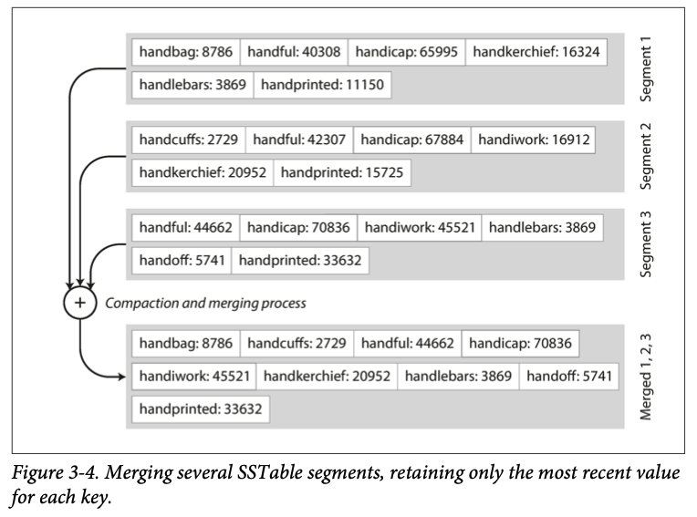
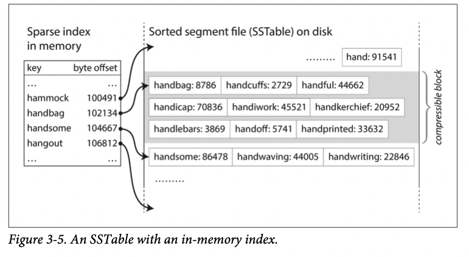
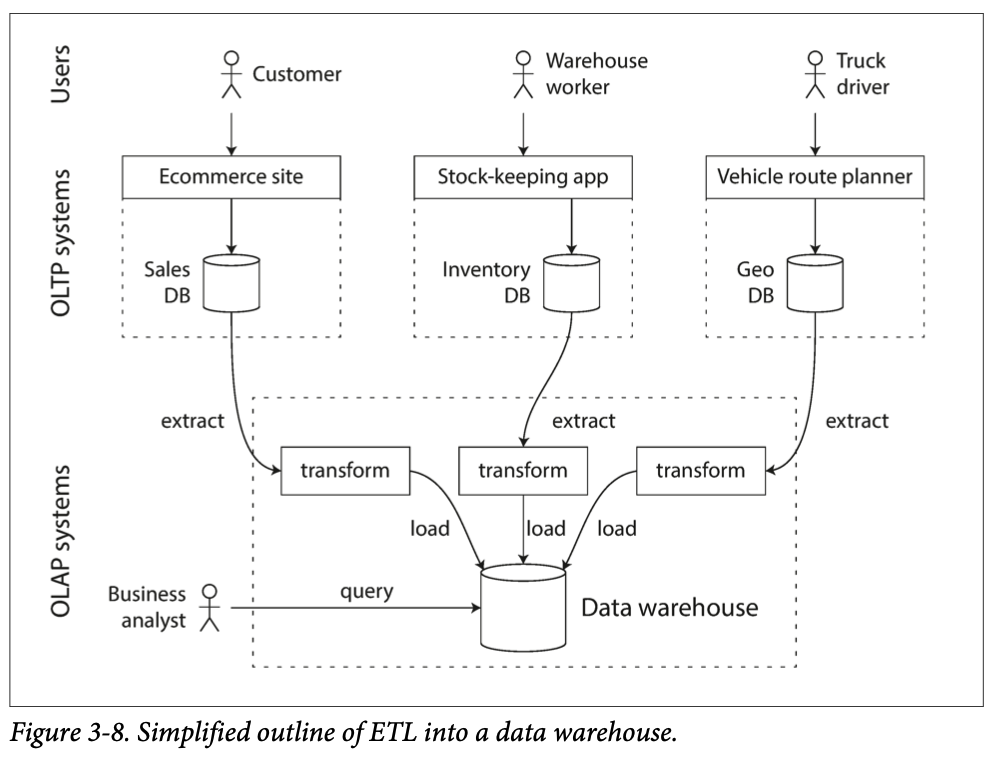
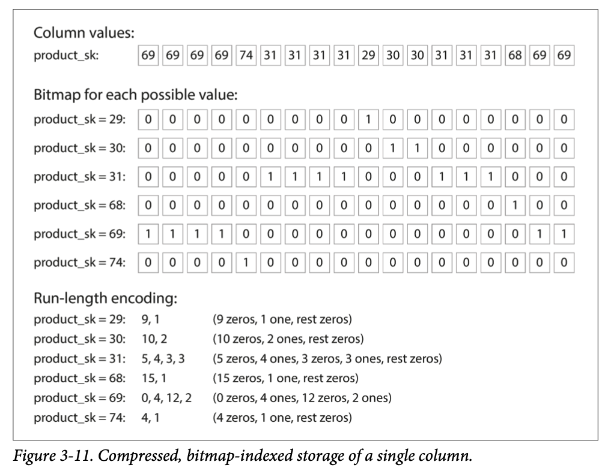

# DDIA
# 2. Data Models and Query Languages (Part 1. Foundations of Data Systems)
## Relational Model Versus Document Model

### The Birth of NoSQL
- NoSQL 이 사용되기 시작한 이유
  - more scalability than relational database
  - need specialized query operation
  - desire for a more dynamic and expressive data model

### The Object-Relational Mismatch
- application layer 에서의 Object 들과 relational table 들과 잘 맞지 않는 경우들이 있다.

### Many-to-One and Many-to-Many Relationships

### Are Document Databases Repeating History?
- NoSQL 이 있기전부터 json 형태의 data model (hierarchical model) 은 존재했고 이들의 한계점을 보완하려고 한게 2가지 진영으로 나눌 수 있는데
  - 이는 relational model, network model (network model: 지금은 fade out) 이다.

### Relational Versus Document Databases Today
#### Which data model leads to simpler application code?
- application data 가 document-like structure (a tree of one-to-many relationships) 인 경우 document model 사용하며 좋다.
- 이때 한계점도 있다.
  - nested item 에 대해 directly refer 할 수 없다.
  - poor support for join
  - many-to-many 관계를 많이 사용하는 application 인 경우 -> join 의 만들기 복잡

#### Schema flexibility in the document model
- document model 은 때때로 "스키마 없음"으로 불리지만, 실제로 데이터를 읽을 때 해석되는 암묵적인 스키마가 있다.

#### Data locality for queries
- document is usually stored as a single continuous string -> if application often needs to access the entire document -> there is a performance advantage to this storage locality
- documents 를 작게 만들고 크기를 키우는 write 는 최대한 안하는게 성능에 좋다.

#### Convergence of document and relational databases
- 두 db 가 점점 비슷한 점이 생기고 있다.

## Query Languages for Data
- imperative code 는 한줄한줄 순서대로 실행하고 원하는 연산을 원하는 순서대로 작성하고 실행한다.
- 반면에 SQL 같은 declarative code 는 원하는 바를 작성하면 optimizer 가 구체적인 실행계획을 만든다.
- declarative 가 상대적으로 parallel execution 하기 힘들다.
### Delacrative Queries on the Web

### MapReduce Querying
- MapReduce: programming model for processing large amounts of data in bulk across many machines

## Graph-Like Data Models
- data 가 many-to-many 관계인 경우, relational db 가 좋지만 관계가 복잡해지면 graph 도 고려할 수 있다.

### Property Graphs
### The Cypher Query Language
### Graph Queries in SQL
### Triple-Stores and SPARQL
### The Foundation: Datalog

# 3. Storage and Retrieval (Part 1. Foundations of Data Systems)
## Data Structures That Power Your Database
- index 를 이용하여 data 를 찾는 작업을 효율적으로 할 수 있다.
- well-chosen indexes speed up read queries, but every index slows down writes
### Hash Indexes
### SSTables(Sorted String table) and LSM-Trees
- sorted by key 해서 효율성을 높인다.

- 특정 key 찾기 위해서 모든 key 들의 index 를 갖고 있을 필요가 없다. 일부 key 들의 offset 을 알면 sorted key 인 상태이므로 범위를 좁혀서 key 를 쉽게 찾을 수 있다.

### B-Trees
- 가장 많이 사용하는 indexing structure

## Transaction Processing or Analytics?
- OLTP(transaction processing)
  - Read pattern: Small number of records per query, fetched by key
  - Write pattern: Random-access, low-latency writes from user input
  - Primarily used by: End user/customer, via web application
  - What data represents: Latest state of data (current point in time)
- OLAP(analytic processing)
  - Read pattern: Aggregate over large number of records
  - Write pattern: Bulk import (ETL) or event stream
  - Primarily used by: Internal analyst, for decision support
  - What data represents: History of events that happened over time

### Data Warehousing
- 90년대부터 analytics 목적으로 OLTP system 을 사용하지 않고 data warehouse 라는 db형태를 사용하기 시작했다.

#### The divergence between OLTP databases and data warehouses
- 주로 relational 이고 비슷해보이지만 내부적으로는 각 특징에 맞는 역할에 최적화되어 있기에 차이가 있다.

## Column-Oriented Storage
- 쿼리사용시 주로 일부 column과 많은 수의 row를 불러온다.
- 그래서 column-oriented storage 가 필요하다.
### Column Compression
- data warehouse 에서 사용하는 compression 방법중 하나가 bitmap encoding 이다.
- 하나의 column 은 distinct 한 값들이 많지 않다. 그래서 bitmap encoding 방법이 유용하다.

### Sort Order in Column Storage
### Writing to Column-Oriented Storage
### Aggregation: Data Cubes and Materialized Views