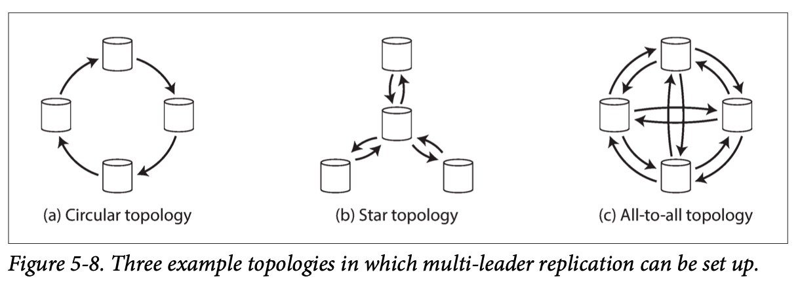
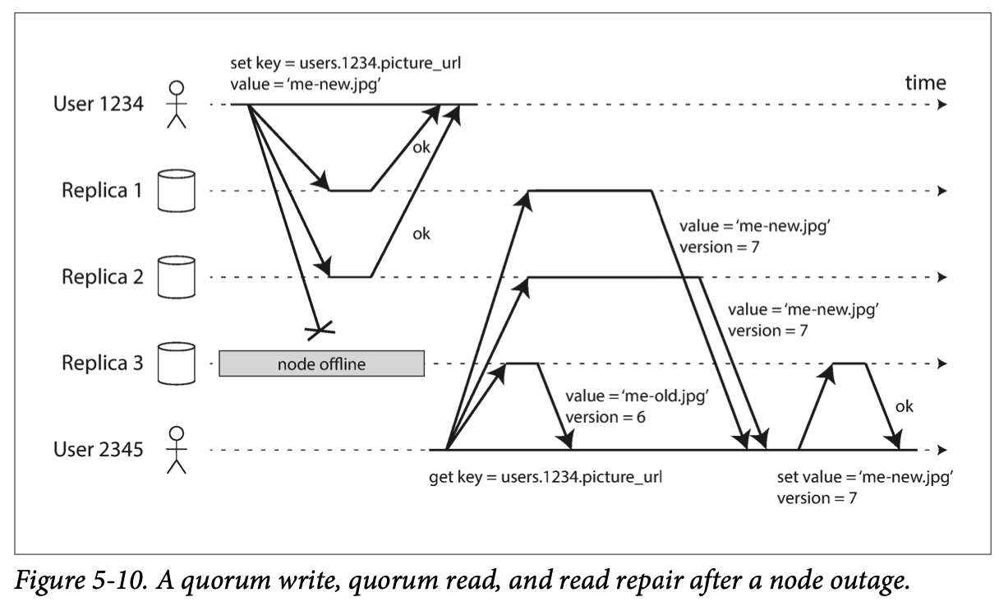
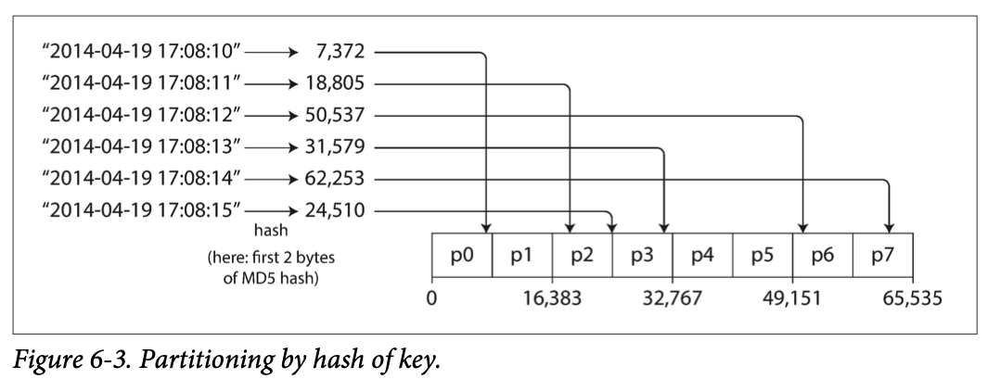
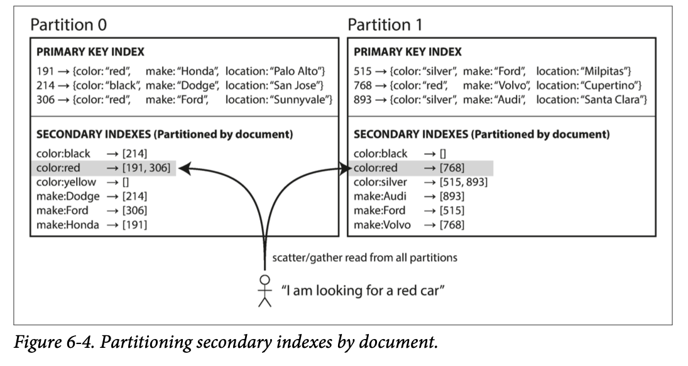
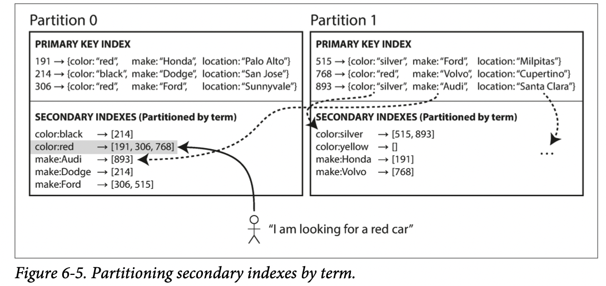
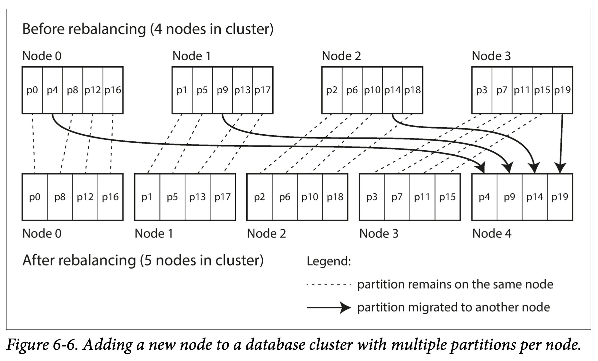
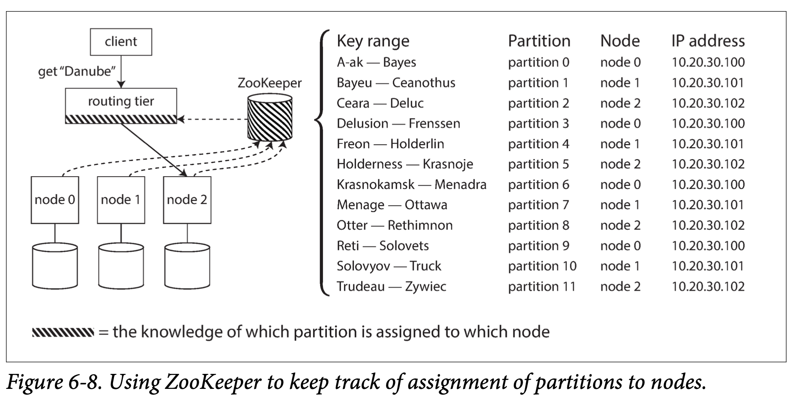
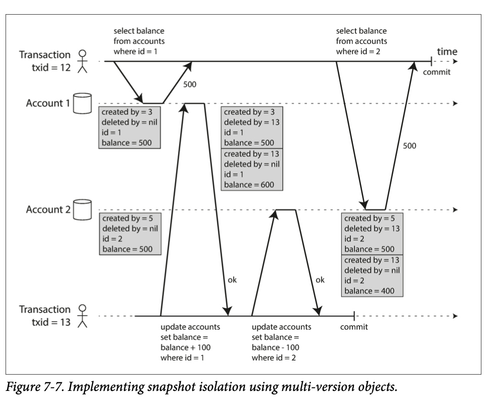
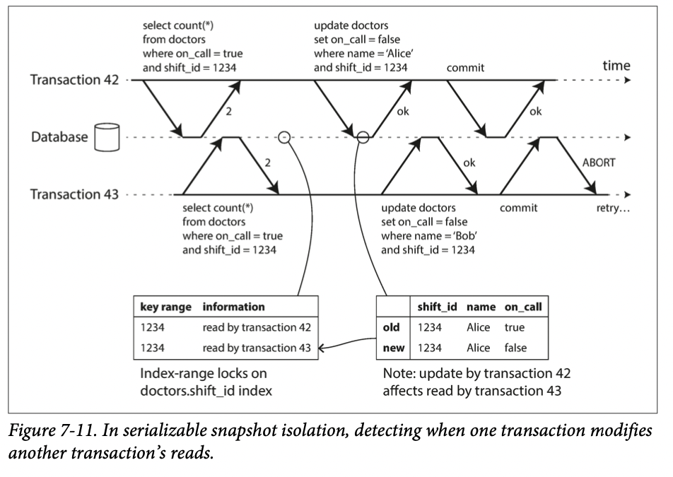

# DDIA
## Intro Distributed data
- why distributed db?
  - Scalability
  - Fault tolerance / high availability
  - Latency
- shared memory architecture 보다 shared-nothing architecture 가 더 많이 사용됨
  - shared-nothing, horizontal scaling, scaling out
- replication vs partitioning

## Ch 5 Replication (Part 2. Distributed Data)
- Replication: keeping a copy of the same data on multiple machines that are connected via a network
- replication 에서 어려운 점은 복사하는게 아니라 복사한 뒤에 데이터에 변화가 생겼을 때 어떻게 적용하는지 이다.

### Leaders and Followers
- replica: each node that stores a copy of the database
- 모든 write 는 모든 replica 에 동일하게 적용되어야하는데 이를 위해 leader-based replication (master-slave, active/passive) 방법을 사용한다.
  - client 는 leader 에 write 요청을 하고 이를 local storage 에 저장
  - leader 는 local stroage 에 저장하면서 follower 들에게 log 를 전달하고 이들도 local copy 를 leader 와 동일하게 업데이트함
  - client 의 read 요청은 leader, follower 모두에게 query 할 수 있지만 write 는 leader 를 통해서만 가능함

#### Synchronous Versus Asynchronous Replication

- synchronous replication: the leader waits until follower has confirmed that it received the write before reporting success to the user, and before making the write visible to other clients
  - 장점: follower 가 leader 와 동일한 상태가 보증된다는 점
  - 단점: follower 에서 response 가 올때까지 기다려야함
- 그래서 주로 syn, asyn 섞어서 사용 (하나의 follower 는 sysn, 나머지는 asyn) -> semi-synchronous

#### Setting Up New Followers
- 새로운 follower 를 추가하는 것은 단순히 leader data 를 복사하는 것으로 해결할 수 없다. 계속해서 write 작업이 들어오기 때문이다. 그렇다고 lock 을 걸로 복사를 하기에는 high avability 가 너무 떨어진다.
- 그래서 다음과 같이 진행한다.
  - 특정시점 leader 의 db 를 snapshot 을 찍는다.
  - 새로운 follower node 에 snapshot 을 복사한다.
  - snapshot 이후 leader 에 발생한 log 들을 잘 갖고 있다가 follower 의 snapshot 작업이 끝나고 해당 log 들을 처리한다. (caught up)

#### Handling Node Outages
- Follower failure: Catch-up recovery
  - follower local disk 에 log of the data changes 를 저장하고 있어서 문제가 생격서 재시작하거나 leader 와의 network 문제가 발생해도 어렵지 않게 recover 가 가능하다.
- Leader failure: Failover
  - leader 에 문제가 생기면 기존 follower 중 하나의 새로운 leader 로 만든다. 진행과정은 아래와 같다.
    - Determining that the leader has failed
    - Choosing a new leader
    - Reconfiguring the system to use the new leader
  - 하지만 이 과정에서 다양한 문제가 발생할 수 있다.

#### Implementation of Replication Logs
- Statement-based replication
  - leader 가 모든 write request 들을 follower 에게 전달하고 follower 들이 이를 실행
  - 하지만 replication 이 성립되지 못하는 경우 발생 가능
    - 예를 들어, `RAND()` 같이 nondeterministic 한 함수를 사용경우 replication 들마다 달라질 수 있음
  - 요즘에는 많이 사용 x, 사용한다면 deterministic 한 경우만 사용
- Write-ahead log shipping
  - leader 에서 만들어진 data structure 와 동일하게 생성해서 follower 에서 처리
  - detail 한 implementation 이 필요한 방법
- Logical (row-based) log replication
  - storage engine 과 log 가 decouple 할 수 있는 방법
  - 이런 replication log 들을 logical log 라고 부름 (storage engine's data representation 과 구분하여)
  - logical log 는 주로 row 에 대한 일련의 write 정보가 담겨있음
- Trigger-based replication

### Problems with Replication Lag
- leader-based replication 에서는 write 는 leader 인 하나의 node 를 통해야하지만 read 는 그럴 필요가 없다. 그냥 follower 에서 바로 진행하면 된다.
- 이를 통해 leader 의 load 도 줄이고 read request 가 늘어나면 follower 를 늘리면 된다. (scalibility) 이는 async replication 에서 효과를 볼 수 있다.
- 하지만 async 도 문제가 있다. outdated 한 상태의 follower 에서 data 를 읽을 수도 있기 때문이다. (consistency x)
- the replication lag: the delay between a write happening on the leader and being reflected on a follower
- replication lag 가 문제가 되는 경우와 이에 대한 해결책을 알아보자.

#### Reading Your Own Writes
- 사용자가 data 를 write 하면 leader 가 받게 된다. 이때 사용자가 data read 를 시도할 때 아직 업데이트되지 않은 follower 의 data 가 노출될 수 있다. -> read-after-write consistency (read-your-writes-consistency) 필요
- how to?
  - 유저가 수정한(수정가능한) 부분은 leader, 그외에는 follower 에서 읽는다.
  - 기준을 정한다. 예를 들어, 마지막 update 후 특정 시간이 지나면 follower 에서 읽는다.

#### Monotonic Reads
- 예를 들어, 2개의 follower 에 update 가 진행되는데 1개가 먼저 되었다고 가정하자. 유저가 동일한 read 를 연속적으로 하면 다른 각 2개의 follower 의 data 를 읽을 수도 있다. 동일한 read 를 했는데 다른 결과가 (처음에는 update 된 결과가 그 후에 outdated 된 결과, time go backward) 노출되는 상황이 발생할 수 있는 것이다. -> Monotonic reads 필요
- how to?
  - 동일한 replication 에서 읽도록 한다.

#### Consistent Prefix Reads
- causality 가 깨지는 경우가 있을 수 있다. 예를 들어, 대화를 나누는 data 인데 read 시 순서가 뒤바뀌는 경우! -> consistent prefix reads 필요
- 일련의 write 가 특정 순서대로 작성되면 read 시에도 동일한 순서대로 노출되야한다.
- how to?
  - causally related data 는 동일한 partition 에 write 되도록 한다.

### Multi-Leader Replication
- write 는 leader 를 통해야하는데 하나 이상의 leader 도 있을 수 있다.

#### Use Cases for Multi-Leader Replication
- Multi-datacenter operation
  - 여러개의 datacenter 에 각 leader 가 있을 때 장점
    - performance
    - leader 에 문제가 생기면 하나의 leader 가 있을 때 tolerance 가 좋다.
    - 여러개의 datacenter 인 상황에서 하나의 leader 만 있으면 inter-datacenter 간의 network 문제가 발생할 수 있다.
  - 단점도 있다. 동일한 data 가 다른 datacenter 에서 수정되어야 하는 경우, write conflict 를 잘 해결해야 한다.
- Clients with offline operation
  - 핸드폰 캘린더 같은 경우 on device leader 가 있고 server 단의 leader 가 있다.
- Collaborative editing
  - 구글 닥스 같은 경우

#### Handling Write Conflicts
- Synchronous vs asynchronous conflict detection
  - 동일한 부분에 대해 두 유저가 write 를 한다고 가정하자.
  - multi-leader 에서 async 하게 conflict detect 를 하면 나중에 작성한 유저에게 다시 작성하라고 이미 늦은 요청을 해야 한다.
  - 따라서 muilti-leader 의 장점을 포기하고 처음 write 가 먼저 replicated 된 후 유저에게 다시 요청한다. (sync) 
- Conflict avoidance
  - conflict 를 애초에 피하는 방법 -> 예를 들어, 특정 유저와 관련된 data, 특정한 data 자체에 대한 write 에 대한 담당 leader 를 설정한다.
- Converging toward a consistent state
  - all replicas must arrive at the same final value when all changes have been replicated
  - covergent conflict resolution 을 achieve 하는 방법
    - 예시방법) write 마다 unique 한 ID 를 할당하고 특정 기준의 write 가 최종 결과가 되도록 rule 지정

#### Multi-Leader Replication Topologies
- 책에서는 3가지 topology 소개
- 각각에 따라 발생할 수 있는 conflict 가 있고 해결 방안도 조금씩 다르다.

### LeaderLess Replication
- 한동한 leaderless style 은 사용되지 않다가 최근 Amazon 의 Dynamo 에서 이를 사용했다.
- client 는 replicas 에 request 를 쏘고 coordinator node 가 이를 도와준다.

#### Writing to the Database When a Node Is Down
- 아래 그림처럼 replica3 이 write 중에 offline 인 상태면 write 가 되지 않는다.
- 그 후에 user2345 가 read 를 할 때 다른 결과를 받을 수도 있다.
- 이 때, 하나의 replica 에 request 를 하지 않고 parallel 하게 다른 node 에도 request 하고 가장 최신 버전의 data 를 사용한다.

- 그렇다면 이후 어떻게 outdated data 를 최신 버전화 할까?
  - Read repair
    - 유저가 outdated data 를 받은 replica 에게 최신 data 를 보내서 write 하게 한다.
  - Anti-entropy process
    - background process 를 통해 상태가 다른 replicas 를 찾고 업데이트한다.
- quorum
  - if there are $n$ replicas, every write must be confirmed by $w$ nodes to be considered successful, and we must query at least $r$ nodes for each read
  - 최소 $w+r > n$ 일 때,  read 시 최신 data 를 얻을 수 있다. 이떄 $r$ 과 $w$ 값을 quorum reads and writes 라고 부른다.
  - $n$ 은 홀수 (주로 3, 5) 로 하고 $w=r=(n+1)/2$ 로 한다. 물론 상황마다 달라진다.

#### Limitations of Quorum Consistency
#### Sloppy Quorums and Hinted Handoff
#### Detecting Concurrent Writes

## Ch 6 Partitioning (Part 2. Distributed Data)
- partition 하는 가장 큰 이유는 scalability 이다. 다른 partition 은 다른 node 에 저장이 가능하다.

### Partitioning and Replication
- 실제로는 당연히 partitioning, replication 은 동시에 사용하지만 이후 설명헤서는 replication 에 대한 내용은 제외한다.

### Partitioning of key-value Data
- partitioning 목적: spread the data and the query load evenly across nodes
- 특정 partition에 data가 몰리는 상태 skewed 되었다고 한다.
- data 가 어디 있는지 찾기 위해서 key-value data model 을 이용해보자.

#### Partitioning by Key Range
- partition 들의 범위를 정해서 나누고 각 partition 에 continuous range 값을 할당한다.
  - 예를 들어, 테이블의 특정컬럼이 10이하이면 partition0으로 나머지는 partition1로 보내는 상황
- partition 안에서는 key 들을 sorted order 로 할당해서 빠르게 찾을 수 있다. (SSTables, LSM-Tree)

#### Partitioning by Hash of Key
- hash function 으로 data 들을 uniformly distributed 하게 할 수 있다.
- 하지만 key-range partitioning 이 보여준 efficient range query 가 불가능하다.

### Partitioning and Secondary Indexes
- secondary indexes 를 partitioning 에 사용하는 방법 크게 2가지

#### Partitioning Secondary Indexes by Document
- 그림처럼 partition 마다 독립적이다. (local index)

#### Partitioning Secondary Indexes by Term
- 모든 partition 에 적용되는 global index 가 있지만 이 또한 partitioning 되어 있다.
- 그림처럼 a~r 까지는 partition0 에 나머지 term 은 parition1 에 이런식으로 둔다.
- document-partitioned index 보다 read 에서 효율적이다. write 는 느리고 복잡하다.

### Rebalancing Partitions
- rebalacing: process of moving load(data, requests,,,) from one node in the cluster to another
- rebalancing 의 minimum requirement
  - rebalancing 후에는 load 가 shared fairly 해야 한다.
  - rebalancing 이 일어나는 동안에도 read, write 는 가능해야한다.
  - 꼭 필요한 만큼의 data 만 이동해야한다.

#### Strategies for Rebalancing
- Fixed number of partitions
  - partition 수를 fix하고 node 수가 달라지면 아래 그림처럼 재분배한다.

- Dynamic partitioning
  - key-range partitioning 을 사용하는 경우 partition 의 boundary 와 수가 fix 된 경우 빈 partition 이 생기거나 너무 꽉찬 partition 이 생길 수 있다.
  - 그래서 dynamic 하게 근처 partition 과 합치거나 나누는 방법을 사용한다.
  - hash-partitioned data 에서도 사용할 수 있다.
- Partitioning proportionally to nodes
  - a fixed number of partitions per node 

#### Operations: Automatic or Manual Rebalancing
- 완전 자동으로 하면 너무 위험하고 사람이 껴있는게 좋다.

### Request Routing
- 여러개의 node 로 partitioning 되어 있을때 client 의 request 를 어떻게 할당할까?
- 다양한 방법들이 있지만 주로 아래 그림처럼 ZooKeeper 같은 툴을 이용한다.

## Ch 7 Transactions (Part 2. Distributed Data) 
- transaction: a way for an application to group several reads and writes together into a logical unit
- 하나의 transaction 의 read, write 들은 하나의 작업으로 실행되기에 부분 실패, 부분 성공이 없다.

### The Slippery Concept of a Transaction
#### The Meaning of ACID
- Atomicity
  - client 가 여러개의 write 를 요청하고 이들이 atomic transaction 으로 처리할 때, 중간에 일부가 fail 하면 전부 undo 처리해야한다. 그래서 변화가 없도록 해야한다.
  - 어쩌면 atomicity 보다 abortability 가 더 적절할지 모르겠다.
- Consistency
  - consistency 는 db 만의 역할은 아니고 application 전체적인 상황에 영향을 받는다.
  - data 가 계속해서 정말 true 한 상태 (invariant)를 의미한다.
- Isolation
  - concurrently executing transactions are isolated from each other
- Durability
  - trasaction 이 성공적으로 commit되면 write 한 data 들은 잃어버리지 않는다.

### Weak Isolation Levels
- 많은 시스템들이 완벽한 isolation 보다는 (performance 이슈) weaker level 의 isolation 을 제공한다.
- 그렇기에 같은 data 에 대한 transaction 이 동시에 발생하면 문제가 될 수 있는 (concurrency problem) 상황에 대해 인지해야한다.

#### Read Committed
- basic level of transaction isolation: read committed
  - When reading from the database, you will only see data that has been committed (no dirty reads)
  - When writing to the database, you will only overwrite data that has been committed (no dirty writes)
- no dirty reads
  - write transaction 이 아직 committed 나 aborted 되지 않았는데 다른 transaction 이 해당 data 를 볼 수 있는 경우 dirty read
- no dirty writes
  -  write transaction 이 아직 commited 되지 않은 상태에서 이후에 요청이 발생한 write transaction 이 overwrite 하는 경우

#### Snapshot Isolation and Repeatable Read
- 다음과 같은 경우 temporary inconsistency 가 발생할 수 있다.
  - Backups
    - backup 하는 중에 write 가 발생할 수 있다. 그러면 old version data 를 backup 하게 되는 것이다.
  - Analytic queries and integrity checks
    - 가끔 결과가 맞지 않거나 다른 경우 발생이 가능하다.
- 이에 대한 해결책이 snapshot isolation
  - each transaction reads from a consistent snapshot of the database
  - 동일한 object 에 대한 다양한 version 을 유지 (multi-version concurrency control - MVCC)
  - 각 row 들은 created_at, deleted_by 필드가 있다. delete transaction 이 발생하면 실제로 db 에서 바로 삭제하지 않고 delete_by 필드에 표시한다. 나중에 transaction 이 더이상 deleted data 에 접근하지 않으면 삭제한다.

- Visibility rules for observing a consistent snapshot
  - transaction ID 에 따라 볼 수 있는 Object 값이 정해진다.
  - 위 그림에서 transaction12가 account2를 읽으면 balance 500이다. (transaction13의 delete가 commit 전이기에)
- Repeatable read and naming confusion
  - snapshot isolation 을 다른 db 에서 다른 이름으로도 부른다. Oracle 에서는 serializable, PostgreSQL&MySQL 에서는 repeatable read

### Preventing Lost Updates
- 지금까지 본 read committed, snapshot isolation level 모두 read-only transaction 과 관련한 내용이다.
- 가장 잘 알려진 write transaction conflict 는 lost update 라는 것이다.
- read -> modify -> write cycle 에서 2개의 transaction 이 concurrently 발생하는 상황에서 발생하는 문제이다.
  - wiki page 를 두 유저가 동시에 수정하는 경우
  - account balance 값을 update 하는 경우 (기존의 값 읽고 수정하고 write)

#### Atomic write operations
- Atomic operations are usually implemented by taking an exclusive lock on the object when it is read so that no other transaction can read it until the update has been applied
#### Explicit locking
- explicitly lock objects that are going to be updated
#### Automatically detecting lost updates
- execute in parallel and, if the transaction manager detects a lost update, abort the transaction and force it to retry its read-modify-write cycle
#### Compare-and-set
#### Conflict resolution and replication

### Write Skew and Phantoms

### Serializability
- Serializable isolation 은 가장 강한 isolation level 이다.
- 그렇다면 전부 이걸 쓰면 되는거 아닌가?
  - 이를 구현하는 것과 성능을 고려해야한다.
- 크게 3가지 방법
  - Literally executing transactions in a serial order
  - Two-phase locking
  - Optimistic concurrency control techniques such as serializable snapshot isolation

#### Actual Serial Execution
- execute only one transaction at a time, in serial order, on a single thread

#### Two-Phase Locking (2PL)
- writers don’t just block other writers; they also block readers and vice versa
- Implementation of two-phase locking
  - reader, writer 들은 각 object 에 대해 lock 을 가질 수 있다.
    - shared mode, exclusive mode
  - transaction 이 read -> shared mode lock 을 얻음 (여러 transaction 이 동시에 얻기 가능)
  - transaction 이 write -> exclusive mode 을 얻음 (다른 transaction 은 동시에 shared, exclusive lock 못 가짐) -> 끝날때 까지 기다림
- Performance of two-phase locking
  - 2PL 을 요즘 많이 사용안하는 이유는 성능이슈 때문이다.
  - 가장 큰 이유는 reduced concurrency 이다.
  - deadlock 도 종종 발생하는 단점도 있다.
- Predicate locks
  - predicate lock: 미팅룸 예약(특정 시간, 특정 방)처럼 특정 search condition 에 맞는 object 에 대해 lock 하는 방법
  - transaction A 가 write(insert, update, delete) 하고 싶다면 먼저 predicate lock 이 존재하는지 확인하고 기다린다.
  - predicate lock 의 핵심은 아직 db 에 없는 (나중에 추가될 수 있는) object 에 대해서도 lock 적용된다는 것이다.
- Index-range locks
  - 근데 predicate lock 별로다. lock 이 많으면 matching lock 을 확인하는데 시간이 오래걸린다.
  - 그래서 대부분 2PL은 index-range locking (simplified approximation of predicate locking) 을 사용한다.
    - 예들 들어, 102호을 12-1시 예약 lock 이라니라 102호 12-18시 예약 lock 처럼 match a greater set of object
  - 시간 컬럼이 index 면 거기에 lock 을 붙인다.

#### Serializable Snapshot Isolation (SSI)
- full serializability, small performance penalty

##### Pessimistic versus optimistic concurrency control
- 2PL 은 pessimistic, serial execution 은 pessimistic extreme
- SSI 은 optimistic concurrency control tech
  - block 하기 보다 transaction 들을 그냥 진행되게 하고 commit 을 해야하는 경우 db 가 문제가 생기면 abort 하고 retry 한다.
- snapshot isolation 에 기반했지만 write 간 충돌을 찾고 abort 를 결정하는 알고리즘이 추가 됐다.

##### Decisions based on an outdated premise
- transaction 은 premise(a fact that was true at the beginning of the transaction) 에 근거하여 진행된다.
- 하지만 commit 하려고 할 때, 이미 premise 는 더 이상 사실이 아닐 수 있다.
- 그렇다면 이를 db 가 어떻게 알 수 있을까?
  - Detecting stale MVCC reads
    - MVCC 를 이용하여 write 충돌을 detect 하면 abort 하고 read 는 detect 해도 abort 하지 않는다.
  - Detecting writes that affect prior reads

##### Performance of serializable snapshot isolation
- 2PL 과 다르게 block 을 기다릴 필요가 없다.
- read-only query 들은 consistent snapshot 에서 lock 없이 비교적 빠르게 돌아가서 read-heavy 에 적절하다.
- serial execution 과 다르게 single cpu 에 한정되지 않는다. multiple machine 에서 partitioned 된 data 들에 대해 적용된다.