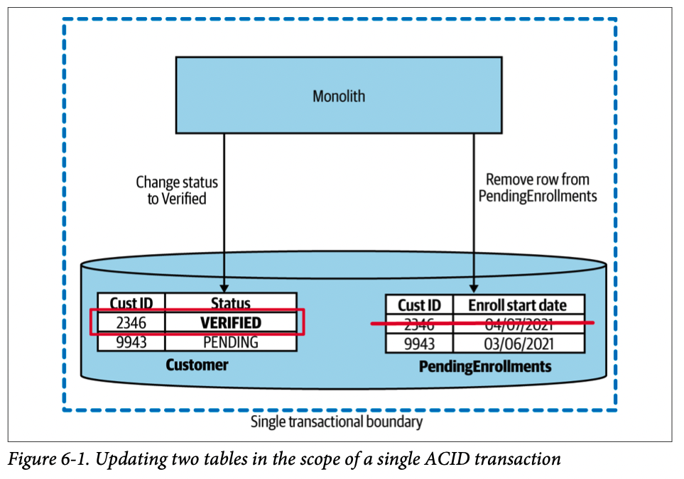
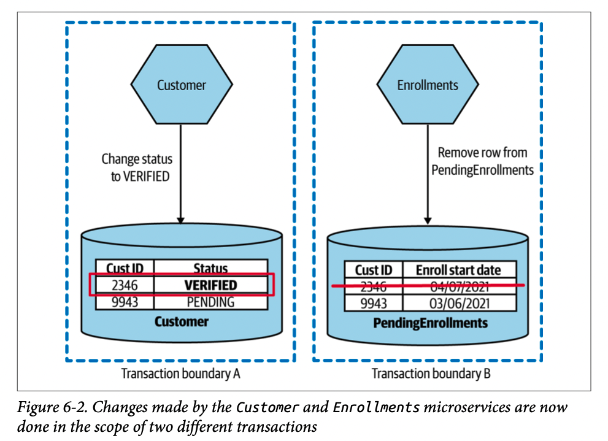
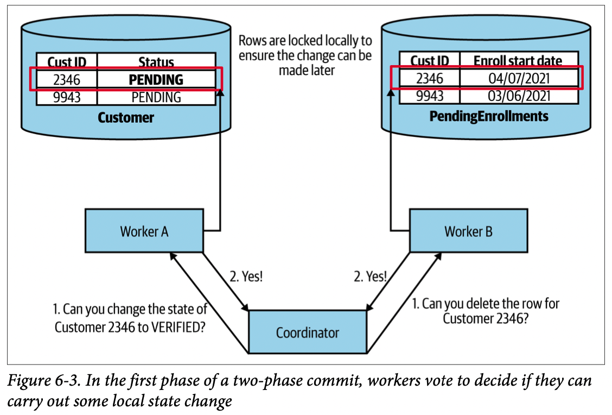
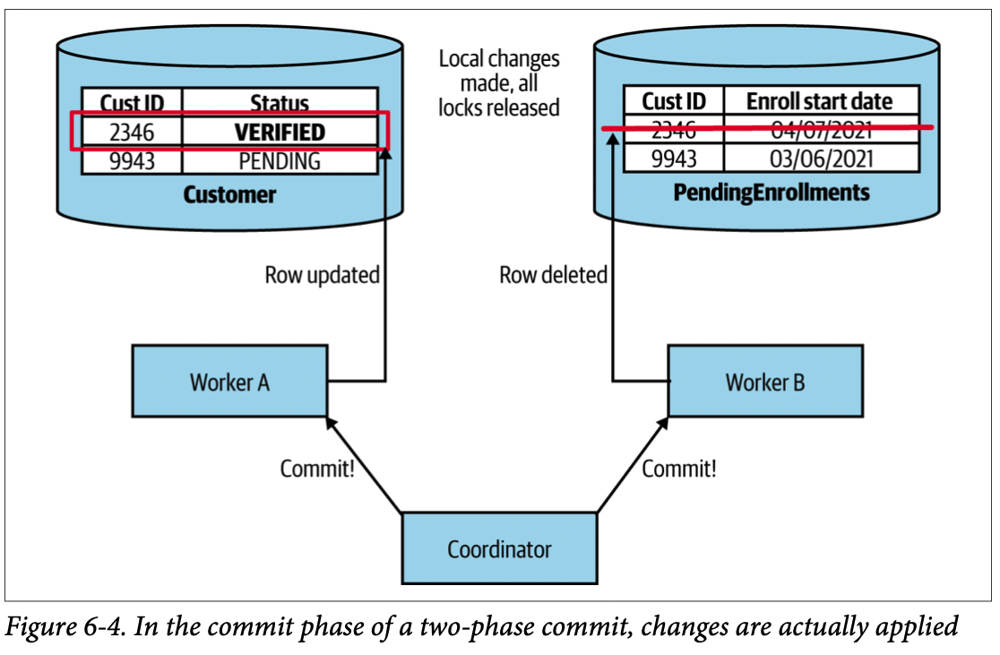
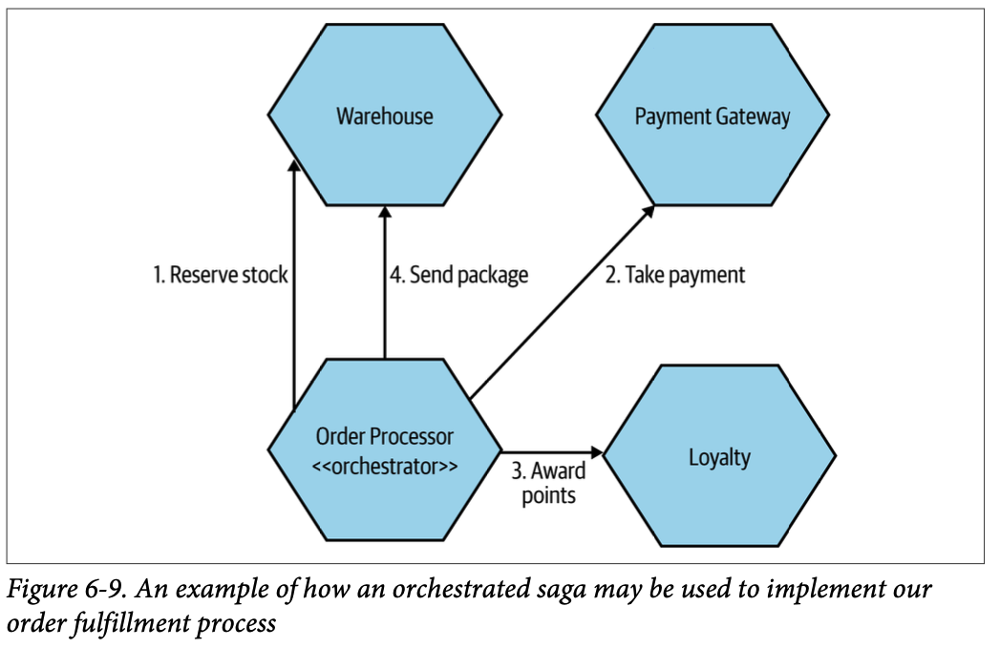
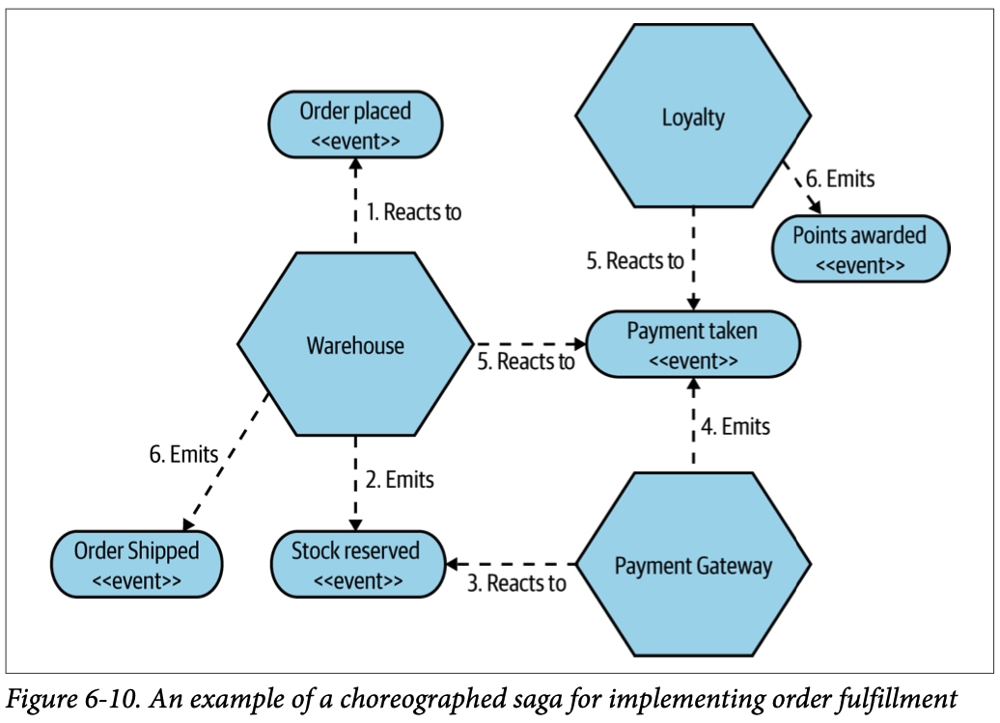
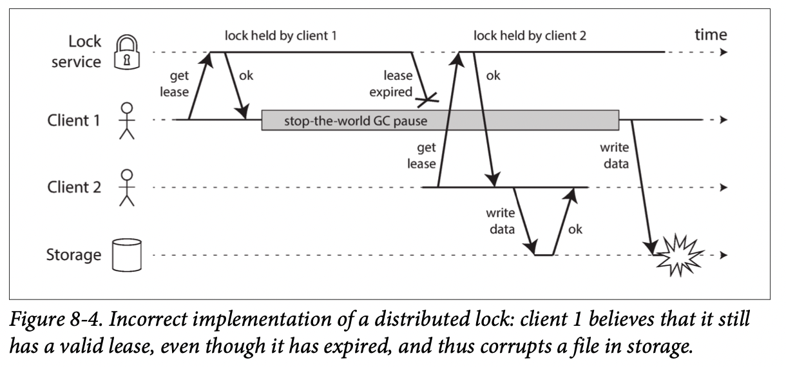
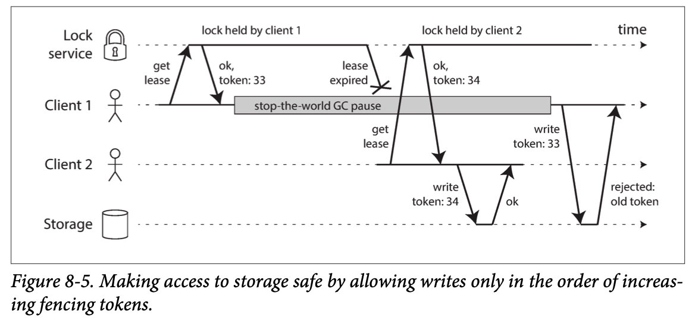
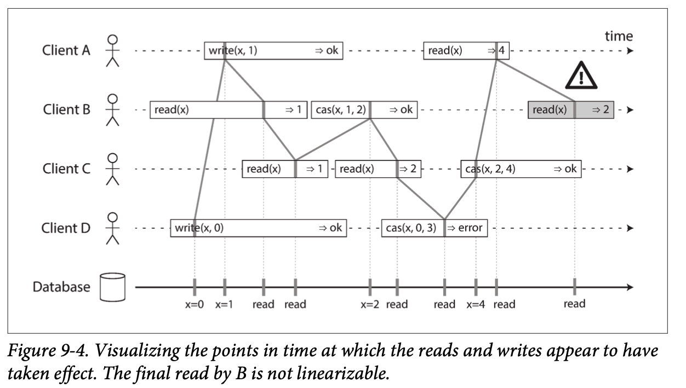
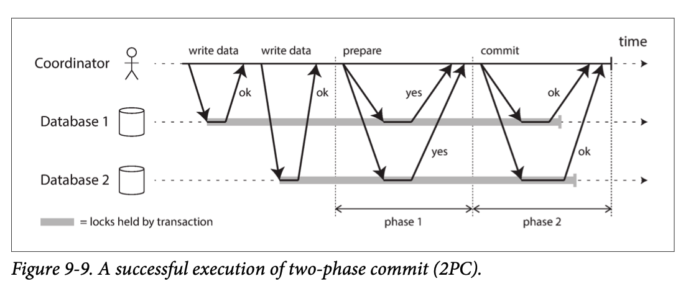

# BM
## Ch 6 Workflow (Part 2. Implementation)
### Database Transactions
- db 에서 하나 이상의 state 가 변하는 것을 보장할 때 transaction 을 사용
#### ACID Transactions
- durability and consistency of data storage 를 보장하기 위한 db transaction 의 key property
  - Atomicity
    - 하나의 transaction 에서 연산들은 무조건 all complete or all fail
  - Consistency
    - db 에 변화가 생기면 valid, consistent 한 상태 보장
  - Isolation
    - 여러개의 transaction 이 방해받지 않고 동시에 진행 가능
  - Durability
    - transaction 이 완료되면 system fail 로 data 유실이 일어나지 않음
- 모든 db 가 ACID 를 보장하는 것은 아님

#### Still ACID, but Lacking Atomicity?
- miscroservice 에서도 ACID-style transaction 을 사용할 수 있음
- 아래 사진으로 monolith 와 비교

- 위 그럼처럼 Customer table 에서 변화가 생기면 PendingEnrollments table 에도 변화가 생김 (two transaction)
  - 근데 PendingEnrollments 쪽에서 fail 이 발생한다면? -> seperate db transaction 인 상태이기 때문에 lack of atomicity !
- 이런 경우 어떻게 할 수 있을지 밑에서 고민 (distributed transaction)

### Distributed Transactions - Two-Phase Commits (2PC)
- distributed system 에서 transactional 변화를 줄 때 사용, microservice 에서도 사용
- 2단계로 이루어져 있음 (voting, commit)
- voting phase
  - coordinator 가 worker 들과 이야기해서 state 를 바꾸기로 확인하고 진행
  - 다만 결정되고 바로 진행되는 것은 아님, 상태에 따라서 진행됨
  - 이때 record 에 대한 lock 이 걸릴 수 있음

- commit phase
  - 2개의 관련된 commit 이 동시에 execute 된다는 보장은 없음

- 2PC 는 주로 short-lived operation 에 사용됨
  - 연산중에 resources locked 이 발생하기 때문

### Sagas
- 2pc 과 다르게 여러개의 state change 를 coordinate 함
- long lived transactions (LLT) 를 잘 다룰 수 있음
  - 일반적인 db 형태는 LLT 가 시간이 오래걸리고 lock 이 발생해서 다른 작업을 하기 어려운 경우가 많음
- LLT 를 더 작은 단위의 transaction 으로 나눠서 진행, microservice 에서는 더 각 service 들이 나눠지는 느낌

### Saga Failure Modes
- Backward recovery
  - rollback 을 의미, 실패하면 다시 다 되돌리는 것
  - single db transaction 에서 rollback 은 어렵지 않지만 ms (saga) 의 형태에서는 compensating transaction 을 이용함
    - compensating transaction: operation than undoes commited transaction
    - 결국 rollback 하는 transaction 을 만드는 것
- Forward recovery
  - retry 를 의미, 실패지점부터 다시 시작
- 둘 다 mix 해서 사용할 수도 있음

### Implementing Sagas
- Orchestrated sagas
  - central coordinator (orchestrator) 사용하여 control (command-and-control approach)
    - define the order of execution and to trigger any required compensating action
- 장단점
  - system 을 한눈에 이해하기 용이함
  - coupled approach, orchestrator 가 많은 것을 알아야함

- Choreographed sagas
  - trust-but-verify architecture
  - microservices are reacting to events being received
  - 하나의 event 에 대해 여러개의 ms 들이 반응할 수 있음

- Mixing styles

### Sagas Versus Distributed Transactions
- distributed transaction 보다 saga 형태 추천

# DDIA
## Ch 8 The Trouble with Distributed Systems (Part 2. Distributed Data)

### Faults and Partial Failures
- This nondeterminism and possibility of partial failures is what makes distributed system hard to work with.

#### Cloud Computing and Supercomputing
- fault 를 잘 해결할 수 있게 개발해야한다.

### Unreliable Networks
- distribute system: focus on shared-nothing system
  - cheap
  - cloud computing service 에 잘 맞음
  - 지역별 데이터센터마다 분산되기에 high reliability
- 인터넷과 데이터센터들의 internal network 들은 asynchronous packet network 이다.
  - 다른 node 로 message 를 보내지만 언제 도착할지 유실이 없는지 등은 보장하지 않는다.
- response message 를 보낼 수 있지만 이 또한 유실 될 수 있다.
- 이를 해결하기 위해 timeout 방법을 사용하지만 timeout 발생시 node 가 message 를 받았는지 아닌지 모르는 건 마찬가지이다.

#### Network Faults in Practice
- 다양한 사례에서 network 문제는 상당히 흔한 것으로 알려져있다.
- 이유도 다양하고 network gear 들을 추가한다고 해결되지도 않았다.
- error handling 이 잘 정의되어 있지 않고 테스트 되지 않으면 문제가 발생할 확률이 높다.

#### Detecting Faults
- 자동으로 faulty node 를 detect 해야 한다.
- request 가 성공적이면 positive response 를 받도록 한다.
- 문제가 생기면 error response 를 받도록 한다. retry 를 할 수도 있고 timeout 이내에 reponse 가 없으면 node 가 죽었다고 판단할 수 있다.

#### Timeouts and Unbounded Delays
- node 가 죽었다고 판단되면 다른 node 가 일을 해야하기에 추가 load 가 생긴다.
- 따라서 죽지 않았는데 죽었다고 판단하는 상황을 최대한 피해야한다.
- timeout 을 짧게 잡으면 위 상황이 발생할 수 있다. 또 너무 길면 error detection 을 잘 못한다.
- network 는 unbounded delays (no upper limit on the time) 를 갖고 있다.
- fixed timeout 을 사용하지 않고 system 에서 지속적으로 check 하면서 자동으로 바꾼다.

#### Synchronous Versus Asynchronous Networks
- 전화통화 같은 경우 circuit 을 만들고 fixed bandwidth 를 할당받는다. 안정적이고 synchronous 하다. bounded delay.
- 하지만 우리 application 들은 task 의 종류에 따라 bandwidth requirement 가 달라진다. TCP 는 dynamically 이를 할당한다.
- there’s no “correct” value for timeouts—they need to be determined experimentally.

### Unreliable Clocks
- 분산시스템에서는 다양한 machine 들이 involved 되기 때문에 일이 일어난 순서를 파악하기 까다롭다.
- 거기에 각 machine 마다 시계가 있고 이들을 모두 정확하지는 않다.
- Network Time Protocol (NTP): clock to be adjusted according to the time reported by a group of servers

#### Monotonic vs Time-of-Day Clocks
- computer 들은 최소 2개의 시계를 갖고 있다.
  - Monotonic clock, time-of-day clock
- time-of-day clock
  - it returns the current date and time according to some calendar
- monotonic clock
  - suitable for measuring a duration (time interval)
  - 절대적인 시각이 중요한게 아니라 차이만 중요
  - doesn’t assume any synchronization between different nodes’ clocks and is not sensitive to slight inaccuracies of measurement

#### Clock Synchronization and Accuracy
- monotonic clock 은 synchornization 이 불필요, time-of-day clock 은 필요
- hardware clock, NTP 가 항상 정확하지는 않다
  - computer 에 있는 quartz clock 은 매우 정확하지는 않다. 조금씩 빠르기도 느리기도 한다.
  - virtual machine 에서는 clock 도 virtualized 된다. cpu share 등 상황에 따라 달라진다.
  - ...
- clock accuracy 를 위해 특별한 노력을 하면 더 정확하게 할 수 있다.

#### Relying on Synchronized Clocks
- clock 은 하루가 정확히 24시간이 아닐 수 있다. node, machine 마다 달라질 수 있다.
- 더 무서운 점은 이를 알아차리기 힘들다는 점!

##### Timestamps for ordering events
##### Clock readings have a confidence interval
##### Synchronized clocks for global snapshots

#### Process Pauses
- 어떻게 leader 인지 판단?
  - 다른 node 로 부터 lease 를 얻게 한다. (similar to lock with a timeout)
  - lease 가 expire 되기 전까지는 leader 로 인식한다.
  - lease 를 유지하기 위해 주기적으로 renew 한다. node 가 fail 나면 renew 를 못하고 expire 되고 다른 node 가 이를 가져간다.
- 이 로직에서 문제가 발생하는 경우가 있으니 조심해야 한다.
  - machine 간 시간차로 인해 발생하는 문제
  - jvm 에서 GC 가 thread 들을 멈추는 문제
  - virtual machine 이 suspend 되는 문제
  - ...

##### Response time guarantees
- real-time guarantee 를 위해서는 모든 level 의 system support 가 필요하다.

### Knowledge, Truth, and Lies
#### The Truth Is Defined by the Majority
- distributed system 에서는 다른 node 들의 판단으로 특정 node 의 상태를 결정한다.

##### The leader and the lock
- 특정 node 가 dead 이거나 잘 work 하지 않는 상태라고 판단했으나 실제로 그렇지 않은 경우 문제가 발생할 수 있다. 아래 그림이 그런 경우이다.

##### Fencing tokens
- 위 같은 문제를 fencing 으로 해결 할 수 있다.

#### Byzantine Faults
- Byzantine Faults: node 가 거짓말을 하는 경우
  - 예를 들어, node 가 특정 message 를 받지 않았는데 받았다고 하는 경우
- A system is Byzantine fault-tolerant if it continues to operate correctly even if some of the nodes are malfunctioning and not obeying the protocol, or if malicious attackers are interfering with the networt.

##### Weak forms of lying
- mechanisms to software that guard against weak forms of “lying” 이 있으면 좋다.

#### System Model and Reality
- system 상에서 발생할 수 있는 fault 들을 어느정도 formalize 하는게 필요하다. 이를 위해 system model 을 정의한다.
- timing 과 관련하여 가장 많이 사용되는 3가지
  - Synchronous model
  - Partially synchronous model
  - Asynchronous model
- node failure 와 관련하여 가장 많이 사용되는 3가지
  - Crash-stop faults
  - Crash-recovery faults
  - Byzantine (arbitrary) faults
- partially synchronous model with crash-recovery faults 가 가장 유용하다.

## Ch 9 Consistency and Consensus (Part 2. Distributed Data)
- The best way of building fault-tolerant systems is to find some general-purpose abstractions with useful guarantees, implement them once, and then let applications rely on those guarantees.
- one of the most important abstractions for distributed systems is consensus: that is, getting all of the nodes to agree on something.

### Consistency Guarantees
- 대부분의 replicated db 는 eventual constistency (convergence) 를 제공한다. 이는 writing 을 멈추고 어느 정도 시간이 흐른 뒤, read 를 하면 항상 동일한 결과는 낸다는 의미다. (we expect all replicas to eventually converge to the same value)
- 하지만 이는 weak guarantee 이고 언제 converge 할지 모른다.
- 그래서 좀 더 stronger consistency 모델을 알아볼 것이다.

### Linearizability
- linearizability (also known as atomic consistency, strong consistency, immediate consistency, or external consistency): guaranteeing that the value read is the most recent, up-to-date value

#### What Makes a System Linearizable?
- to make a system appear as if there is only a single copy of the data
- 아래 그림에서 x 는 register 라고 한다. 예를 들어, key-value store 에서는 하나의 key 가 register 이다. relational db 에서는 하나의 row 이다.

#### Relying on Linearizability
- Linearizability 는 언제 유용할까?
  - Locking and leader election
  - Constraints and uniqueness guarantees
  - Cross-channel timing dependencies

#### Implementing Linearizable Systems
- linearizability 를 가장 쉽게 구현하는 방법은 정의를 따라 하나의 data copy 만 사용하는 것이다.
- 하지만 이는 fault-tolerant 하지 않다. 따라서 replication 을 이용해야 한다.
  - Single-leader replication (potentially linearizable)
  - Consensus algorithms (linearizable)
  - Multi-leader replication (not linearizable)
  - Leaderless replication (probably not linearizable)

#### The Cost of Linearizability
- application 에서 linearizability 를 require 했을 시, disconnected network 문제가 발생하면 request 를 처리할 수 없다.

### Ordering Guarantees
- 'linearizable register behaves as if there is only a single copy of the data' 라는 것은 결국 well-defined order 대로 연산이 실행된다는 것을 의미한다.

#### Ordering and Causality
- ordering 이 중요한 이유는 이를 통해 알 수 있는 causality 때문이다.
- If a system obeys the ordering imposed by causality, we say that it is causally consistent.

##### The causal order is not a total order
- Linearizability 는 total order 연산이라고 할 수 있다.
- 이에 반해 causality 는 partial order 이다. 두 event 가 causally related 되어 있으면 ordering 할 수 있다.
- 하지만 concurrent 한 경우는 incomparable 하다.

##### Linearizability is stronger than causal consistency
- linearizability implies causality

#### Sequence Number Ordering
- we can use sequence numbers or timestamps to order events

#### Total Order Broadcast

### Distributed Transactions and Consensus
- Consensus: get several nodes to agree on something
- consensus 가 중요한 예시
  - Leader election
  - Atomic commit

#### Atomic Commit and Two-Phase Commit (2PC)
- Two-phase commit: an algorithm for achieving atomic transaction commit across multiple nodes
- 아래 그럼처럼 2개의 phase가 있고 coordinator 가 있다.
- 먼저 commit 할 준비가 되면 coordinator 가 node들에게 prepare request 를 보낸다.
- 모든 node들이 yes 하면 commit request 를 보낸다. 이때 하나의 node만이라도 no 하면 모든 node들에게 abort request 를 보낸다.

#### Distributed Transactions in Practice

#### Fault-Tolerant Consensus

#### Membership and Coordination Services
- Zookeepr 같은 coordination and configuration sevices 들이 distributed system 에서 갖는 장점
  - Linearizable atomic operations
  - Total ordering of operations
  - Failure detection
  - Change notifications
- Allocating work to nodes
  - nodes are removed or fail, other nodes need to take over the failed nodes’ work -> 이런 일들을 ZooKeeper 가 가능
- Service discovery
  - find out which IP address you need to connect to in order to reach a particular service
- Membership services
  - which nodes are currently active and live members of a cluster