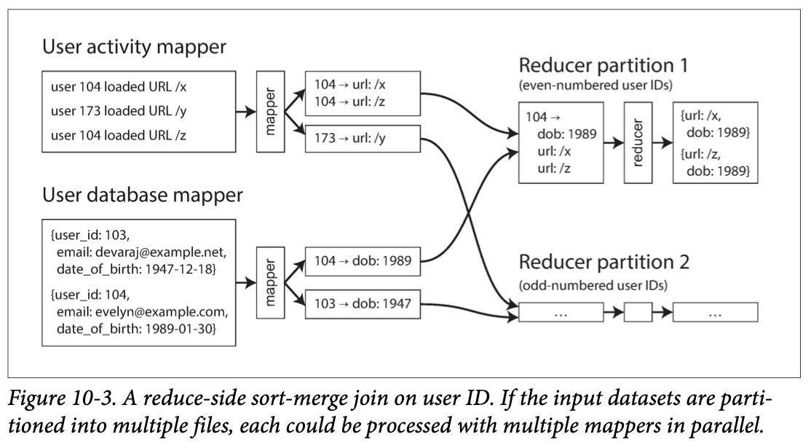

# DDIA:
# Ch 4. Encoding and Evolution (Part 1. Foundations of Data Systems)
## Formats for Encoding Data
##  Modes of Dataflow

# Ch 10. Batch Processing
- 3가지 type 의 system
  - Services (online systems)
  - Batch processing system (offline systems)
  - Stream processing system (near-real time systems)
## Batch Processing with Unix Tools
### Simple Log Analysis
### The Unix Philosophy
## MapReduce and Distributed Filesystems
- HDFS is based on the shared-nothing principle
- HDFS has scaled well
### MapReduce Job Execution
- Mapper
  - extract the key and value from the input record
- Reducer
  - collects all the values belonging to the same key, and calls the reducer with an iterator over that collection of values

### Reduce-Side Joins and Grouping
- Sort-merge joins
  - mapper 의 output 을 sort 하고 reducer 의 input 으로 넣기 때문에 join key 끼리 가깝다
  - 아래 그림 처럼 분산해서 처리가 가능하다.

- Handling skew
  - bringing all records with the same key to the same place 이 어려운 경우가 있다.
  - 특정 join key 가 너무 많은 경우가 그렇다 (예를 들어 인스타에서 연예인 같은 경우 많은 사람과 연결됨)
  - 하나의 reducer 에 해당 key 가 들어가면 이와 join 하려는 수많은 데이터가 몰리게 되고 느려지게 된다.
  - 이를 위해 hive 같은 경우 map-side join 을 한다.

### Map-Side Joins
#### Broadcast hash joins
- large dataset 과 small dataset 을 join 할 때, small dataset 이 mapper memory 에 올라갈 수 있는 경우 사용
- small dataset 을 읽어서 in-memory hash tabel 을 만들어서 join

#### Partitioned hash joins
#### Map-side merge joins
#### MapReduce workflows with map-side joins

### The Output of Batch Workflows

### Comparing Hadoop to Distributed Databases
- Diversity of storage
  - db 에 비해 hadoop 파일 시스템은 형식이 자유롭다.
- Diversity of processing models
  - sql 만으로 하기 어려운 processing 이 생겼고 (ML 등) hadoop 이를 할 수 있는 다양한 모델들이 존재한다.

## Beyond MapReduce
### Materialization of Intermediate State
### Graphs and Iterative Processing
### High-Level APIs and Languages

# Ch 11. Stream Processing (Part 3. Derived Data)
- batch processing 이 가지고 있는 단점 때문에 stream processing 을 사용하게 되었다.

## Transmitting Event Streams
- input 이 file 일 때, 먼저 이를 sequence of records(events) 로 나눈다.
- event 는 text string, JSON, some binary form 등으로 encode 되어서 network 를 통해 다른 node 로 보낸다.
- 관련있는 event 들은 topic 이나 stream 으로 묶인다.

### Messaging Systems
- consumer 에게 새로운 events 가 생겼음을 알리는 방법은 messging system 이다.
- Direct messaging from producers to consumers
  - producer 와 consumer 사이에 intermediary nodes 가 없이 진행한다.
  - message loss 발생해도 해결하기 어렵다.
  - consumer 가 offline 이고 producer 가 retry 를 하는데 문제가 생기면 데이터가 날아갈 수도 있다.
- Message brokers
  -  a kind of database that is optimized for handling message streams
  -  server 역할이고 producer, consumer 가 client
-  Multiple consumers
   - Load balancing, Fan-out 2가지 방법 존재

- Acknowledgments and redelivery
  - consumer 는 borker 에서 해당 message 에 대한 처리가 끝났다는 ack 를 보내준다. ack 을 받지 못하면 message 처리에 문제가 있다고 판단하여 다시 보낸다.

### Partitioned Logs
## Database and Streams
## Processing Streams