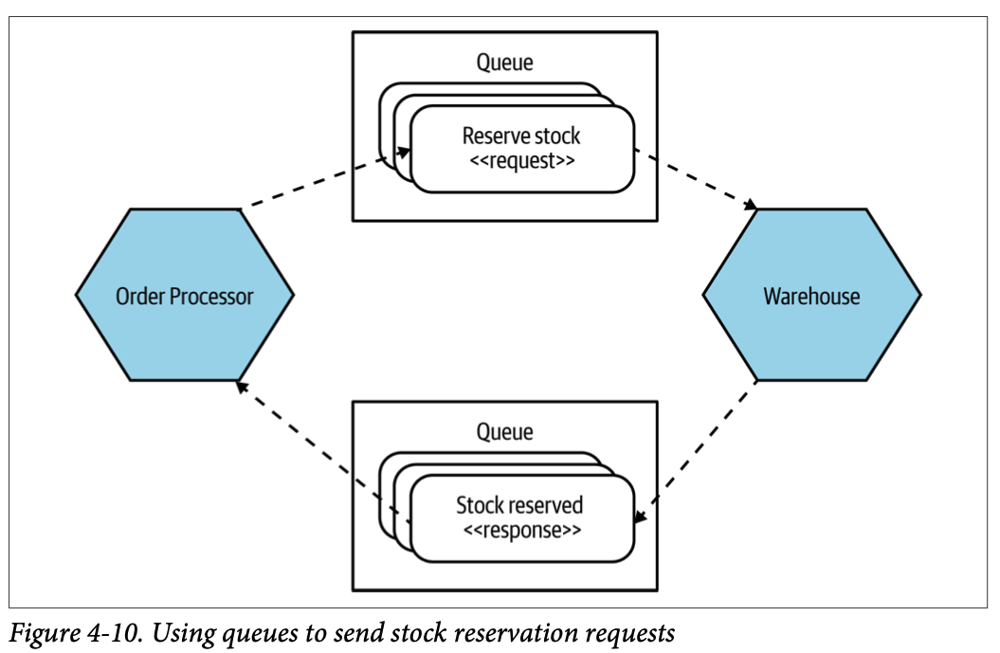
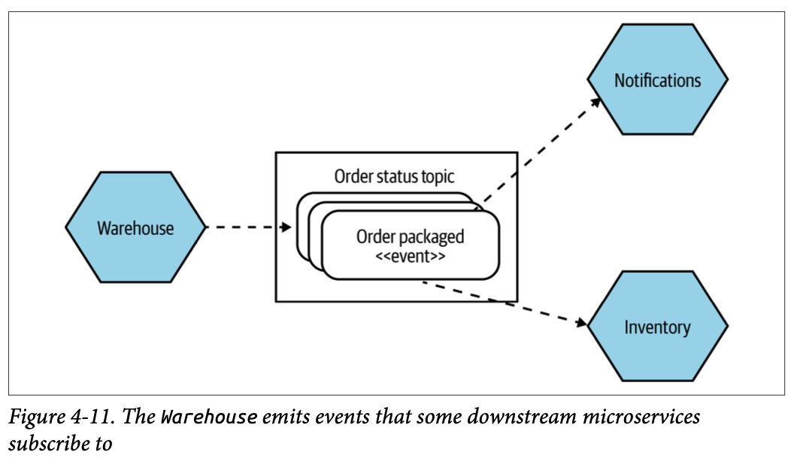
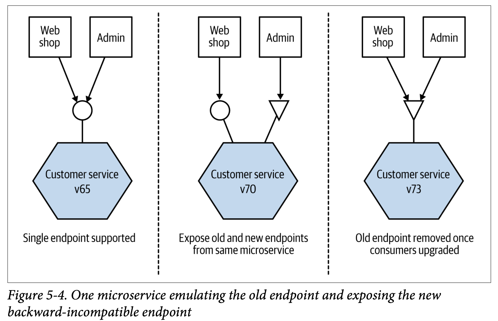
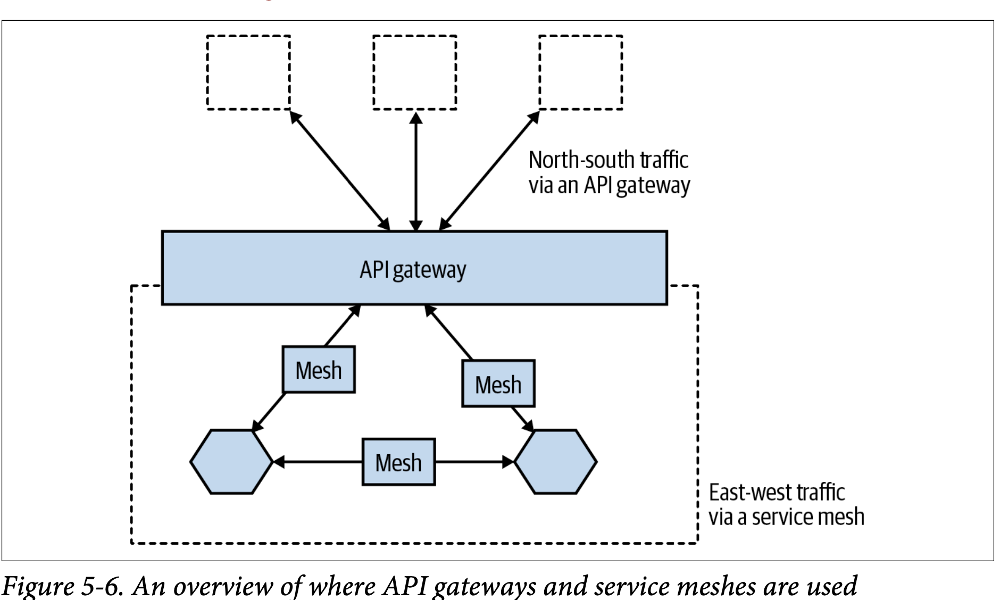
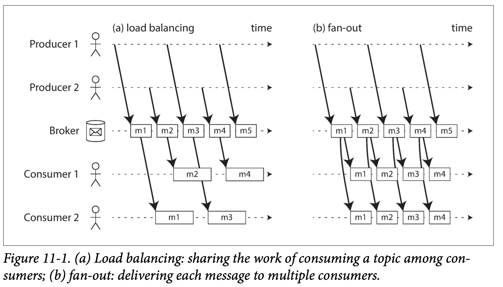

# BM 
# Ch 4. Microservice Communication Styles (Part 1. Foundation)
## From In-Process to Inter-Process
- inter-process: calls between different processes across a network
- in-process: calls within a single process

### Performance
- in-process 가 당연히 더 간단하고 최적화하기 쉽다.

### Error Handling
- 5 inter-process communication failure
  - crash failure
  - omission failure: response 가 없는 경우
  - timing failure
  - response failure: response 가 왔지만 빠진게 있는 경우
  - arbitrary failure: 문제가 생겼지만 다른 node 들이 잘 모르는 경우

## Technology for Inter-Process Communication: So Many Choices
## Styles of Microservice Communication
- communication style 을 정하고 구현한다.
- 물론 microservice 는 하나의 style 을 갖고 있지 않고 여러 개가 섞여있다.

## Pattern: Synchronouns Blocking
- microservice sends a call of some kind to a downstream process (likely another microservice) and blocks until the call has completed, and potentially until a response has been received.
  - 이는 response 가 추후 연산에 필요하거나 call 이 잘 work 했는지 확인해야하는 경우
- 장점
  - 익숙하고 대부분의 inter-process 의 상황을 커버할 수 있다.
- 단점
  - inherent temporal coupling
  - synchronous calls can make a system vulnerable to cascading issues caused by downstream outages
- 언제사용?
  - 근데 chains of call 이 생기면서 문제가 발생하기 때문에 이를 고려해서 개발

## Pattern: Asynchronous Nonblocking
- response 를 기다리지 않고 진행
- 다양한 형태가 있지만 3가지 대표 스타일:
  - Communication through common data
  - Request-response
  - Event-driven interaction
- 장점
  - request 를 처리하는데 시간이 오래 걸리는 경우 유용
- 단점
  - 복잡하다.

## Pattern: Communication Through Common Data
- 어떤 ms 가 data 를 특정 장소에 넣고 이를 다른 ms 가 사용하는 경우 이 패턴을 사용한다.
- 구현
  - persistent store for the data 가 필요하다.
  - 흔한 예시 2가지: data lake, data warehouse
    - 위와 같은 경우 정보의 흐름이 sigle direction 이다. 하나의 ms 가 data store 에 넣고 다른 consumer 들이 이를 가져간다.
    - 하지만 넣는 ms 가 여러개가 되는 순간 (같은 data 에 대해) 복잡해진다.
- 장점
  - 구현하기 쉬운 편이다.
- 단점
  - data 가 바뀌는 것에 대해서 downstream 쪽에서 인지할 수 있어야 한다.
  - common data store 는 결국 potential source of coupling 이다.
- 언제 사용?
  - 간단하고 common store 가 있기에 system 들 간의 스펙차이가 있어도 interoperability 가능
  - 크기가 큰 data 를 share 해야 할 때

## Pattern: Request-Response Communication
- sync 로 할 수도 있고 async 로 구현할 수도 있다.
- async 로 구현한다면 아래 그림처럼 중간에 queue 를 이용하여 구현할 수 있다.

- 거의 대부분의 request-response 형태는 time-out handling 기능이 있다. (있어야 한다)
- 언제 사용?
  - request 에 대한 결과가 필요한 경우
  - ms 가 call 이 work 하는지 파악이 필요한 경우

## Pattern: Event-Driven Communication
- event 를 보내는 ms 는 보내기만 하고 그 이후 일에 대해서는 모른다.
- coupling 이 떨어진다.
- 구현?
  - 2가지 고려: event 를 emit 하는 방식, consumer 가 event 가 발생한 것을 알아채는 방식
- event?
  - event 를 보내는 ms 입장에서는 누가 event 가 필요한지도 모르는데 어떤 정보가 필요할까?
  - ID
    - id 만 주고 이에 대한 추가정보는 consumer 가 다른 곳에서 fetch 하도록 한다.
  - Fully detailed events
    - (저자가 선호한다고 함) 모든 정보를 넣는다.
    - looser coupling
    - 물론 데이터 크기를 고려해야 한다.
    - 특정 ms 가 보지 않았으면 하는 정보가 노출될 수 있다.
    - 정보가 수정, 삭제되는 상황도 고려해야한다.

# Ch 5. Implementing Microservice Communication (Part 2. Implementation)
## Looking for the Ideal Technology
- Make Backward Compatibility Easy
  - 다른 ms 들과 연결성 때문에 backward-compatible 한게 좋다.
- Make Your Interface Explicit
  - ms 에서의 변화가 어떤 상황을 발생시킬지 명확하게 알고 있는데 좋다.
- Keep Your APIs Technology Agnostic
  - 변화가 따른 IT 산업
- Make Your Service Simple for Consumers
- Hide Internal Implementation Detail

## Technology Choices
- 몇가지 유명한 옵션들을 살펴보자.

### Remote Procedure Calls
- RPC: technique of making a local call and having it execute on a remote service somewhere
- 대부분 explicit schema 가 필요하다.
- challenges
  - Technology coupling
    - 몇 RPC 들은 특정 platform 에 국한되어 있다.
    - gRPC, SOAP 같은 건 아니다.
  - Local calls are not like remote calls
    - 예를 들어, 네트워크 문제가 발생할 수 있다.
  - Brittleness

### REST
- REST 에서 중요한 부분은 concept of resources 이다. (client 와 server 가 같은 정보에 대해 소통하는 형태)

### GraphQL

### Message brokers
- popular choice to help implement asynchronous communication between microservices
- broker는 topic 기능을 주로 제공하는데 consumer 들은 topic 만 선택하면 메시지들을 받을 수 있다. 즉, 동일한 데이터를 복사하여 여러 consumer 가 consume 할 수 있는 것이다.
- 또다른 장점은 guaranteed delivery 이다.

## Serialization Formats
### Textual Formats
- textual format 은 consumer 에게 flexibility 를 준다.
- 사람이 읽고 쓰기가 편하다.
- REST API 에서 주로 textual format 을 사용한다.
- 특히 API 의 주 고객층이라 할 수 있는 browser 와 json 이 잘 맞는다. 그래서 json 이 널리 쓰이게 되었다.

### Binary Formats
- payload size, the efficiencies of writing and reading the payloads 에 대한 고민이 시작되었다면 binary format 을 고려해야한다.

## Schemas
- schemas 는 다양한 형태가 있고 어떤 serialization format 을 사용하느냐에 따라 어떤 schema technology 를 사용할지 달라진다.

### Structural Versus Semantic Contract Breakages

### Should You Use Schemas?
- 저자는 explicit 하게 schemas 를 사용하는 것을 권장

## Handling Change Between Microservices
- 어떻게 ms 의 change 를 처리할 것인가? 먼저 피해야하는 상황부터 알아보자.

## Avoiding Breaking Changes
- breaking change 를 피하기 위한 방법
- Expansion Changes
  - ms interface 에서 기존 것은 없애지 않고 새로운 것을 추가만 한다.
- Tolerant Reader
  - implementing a reader able to ignore changes
- Right Technology
- Explicit Interface
- Catch Accidental Breaking Changes Early

## Managing Breaking Changes
- Lockstep Deployment
  - ms interface 가 바뀌면 다른 consumer 도 바꾸도록 한다.
- Coexist Incompatible Microservice Versions
  - 여러 개의 버전을 유지하면서 각 consumer 들이 이용하는 버전에 따라 적절하게 route 한다.
- Emulate the Old Interface
  - 아래 그림처럼 동일한 ms 에 대해 interface 를 과거와 현재 버전을 사용한다. consumer 들이 새 버전으로 이전을 하면 과거 버전을 없앤다.

## DRY and the Perils of Code Reuse in a Microservice World
### Sharing Code via Libraries
- client library
  - this makes it easy to use your service and avoids the duplication of code required to consume the service itself

## Service Discovery
### Domain Name System (DNS)
### Dynamic Service Registries
- ZooKeeper
- Consul
- etcd and Kubernetes

## Service Meshes and API GateWays
- Service meshes and API gateways can potentially allow microservices to share code without requiring the creation of new client libraries or new microservices.

### API Gateways
### Service Meshes
## Documenting Services

# DDIA:
# Ch 4. Encoding and Evolution (Part 1. Foundations of Data Systems)
## Formats for Encoding Data
##  Modes of Dataflow

# Ch 11. Stream Processing (Part 3. Derived Data)
- batch processing 이 가지고 있는 단점 때문에 stream processing 을 사용하게 되었다.

## Transmitting Event Streams
- input 이 file 일 때, 먼저 이를 sequence of records(events) 로 나눈다.
- event 는 text string,JSON, some binary form 등으로 encode 되어서 network 를 통해 다른 node 로 보낸다.
- 관련있는 event 들은 topic 이나 stream 으로 묶인다.

### Messaging Systems
- consumer 에게 새로운 events 가 생겼음을 알리는 방법은 messging system 이다.
- Direct messaging from producers to consumers
  - producer 와 consumer 사이에 intermediary nodes 가 없이 진행한다.
  - message loss 발생해도 해결하기 어렵다.
  - consumer 가 offline 이고 producer 가 retry 를 하는데 문제가 생기면 데이터가 날아갈 수도 있다.
- Message brokers
  -  a kind of database that is optimized for handling message streams
  -  server 역할이고 producer, consumer 가 client
-  Multiple consumers
   - Load balancing, Fan-out 2가지 방법 존재

- Acknowledgments and redelivery
  - consumer 는 borker 에서 해당 message 에 대한 처리가 끝났다는 ack 를 보내준다. ack 을 받지 못하면 message 처리에 문제가 있다고 판단하여 다시 보낸다.

### Partitioned Logs
## Databased and Streams
## Processing Streams

# APP:
# Ch 8. Events and the Message Bus (Part 2. Event-Driven Architecture)
## Avoding Making a Mess
## Single Responsibility Principle
- if you can’t describe what your function does without using words like “then” or “and,” you might be violating the SRP.
## All Aboard the Message Bus!
- domain events, message bus
- event 는 value object
### The Model Raises Events
- domain model records a fact that happened, we say it raises an event
### The Message Bus Maps Events to Handlers
- Handlers are subscribed to receive events, which we publish to the bus

## Option1: The Service Layer Takes Events from the Model and Puts Them on the Message Bus
## Option2: The Service Layer Raises Its Own Events
## Option3: The UoW Publishes Events to the Message Bus

# Ch 9. Going to Town on the Message Bus (Part 2. Event-Driven Architecture)
## A New Requirement Leads Us to a New Architecture
## Refactoring Service Functions to Message Handlers
## Implementing Our New Requirement
## Test-Driving a New Handler
## Optionally: Unit Testing Event Handlers in Isolation with a Fake Message Buss

# Ch 10. Commands and Command Handler (Part 2. Event-Driven Architecture)
## Commands and Events
## Differences in Exception Handling
## Discussion: Events, Commands, and Error Handling
## Recovering from Errors Synchronously

# Ch 11. Event-Driven Architecture: Using Events to Integrate Microservices (Part 2. Event-Driven Architecture)
## Distributed Ball of Mud, and Thinking in Nouns
## Error Handling in Distributed Systems
## The Alternative: Temporal Decoupling Using Asynchronous Messaging
## Using a Redis Pub/Sub Channel for Intergration
## Test-Driving It All Using an End-to-End Test
## Internal Versus External Events