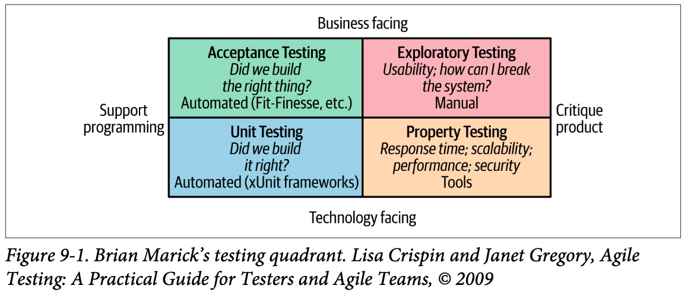
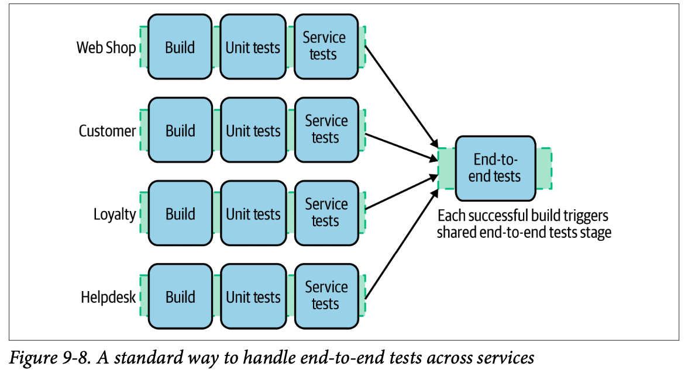
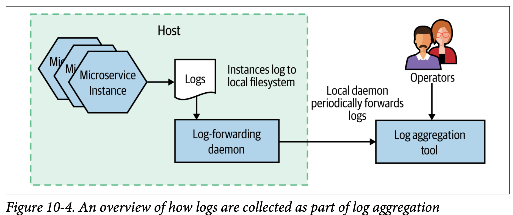
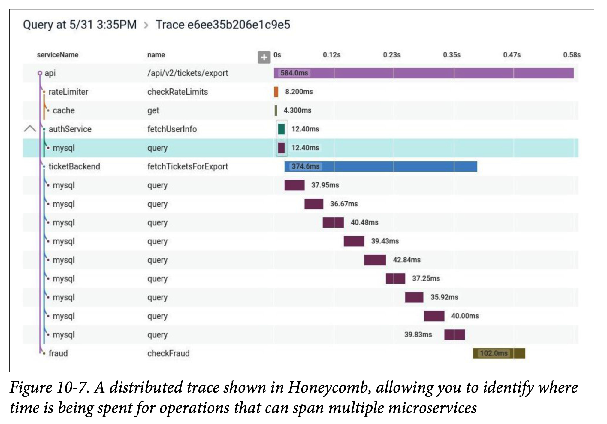

# BM
# Ch 9. Testing
## Types of Tests


## Test Scope
### Unit Tests
- typically test a single function or method call
- primary goal of these tests is to give us very fast feedback about whether our functionality is good
### Service Tests
- designed to bypass the user interface and test our microservices directly
- test an individual microservice’s capabilities
### End-to-End Tests
- tests run against your entire system

## Implementing Service Tests
### Mocking or Stubbing
- Stubs provide predefined responses to calls and focus on outcomes, while mocks record and validate interactions between the actual database objects, thus concentrating on behavior.

## Implementing End-to-End Tests
- 모든 service 전체적으로 다같이 test
- his test has a much larger scope, resulting in more confidence that our system works! On the other hand, these tests are liable to be slower and make it harder to diagnose failure
- 다양한 service 가 있어서 end-to-end test 진행시 어려움이 있다.
  - 예를 들어, 나뿐만 아니라 다른 service 에서도 새로운 기능이 있어서 테스트를 진행해야하는데 end-to-end 를 어떤 버전으로 해야하나? 누가 해야하나?
- 그래서 아래 그림같은 fan-in 방법을 추천한다.



## Should You Avoid End-to-End Tests Run?
## Developer Experience
## From Preproduction to In-Production Testing
### Types of In-Production Testing
- Smoke tests
- injecting fake user behavior

### Mean Time to Repair over Mean Time Between Failures?
## Cross-Functional Testing

# Ch 10. From Monitoring to Observability
## Single Microservice, Single Server
- 가장 단순한 상태
- cpu, memory, response time, server log, health check 등 확인하면 좋음
## Single Microservice, Multiple Servers
- server 들을 각각 보기 어렵기 때문에 한번 잘 확인할 수 있도록 해야함
## Multiple Services, Multiple Servers
## Observability Versus Monitoring
- observability of a system: the extent to which you can understand the internal state of the system from external outputs
  - observability 가 좋아질수록 문제가 생겼을 시 해결하기 쉬워진다.
- Monitoring is something we do. We monitor the system.
- monitoring as an activity (something we do) with observability being a property of the system.
## Building Blocks for Observability
### Log Aggregation
- log agg 는 아주 유용하고 상대적으로 개발하기 어렵지 않다.



- common format
  - central log store 에 log 를 보내기 전에 formatting 하기 보다 raw 하게 보내는 것을 추천한다.
  - 원하는 정보를 어느정도 맞추면 되고 json format 도 정보를 다루기에 좋다. 다만, human readable 하지는 않아서 유의해야한다.
- Correlating log lines
  - 다양한 service 들이 interacting 하기 때문에 log 에 id 를 남기는게 좋다. 그러면 특정 부분에 error 가 발생했을시 다른 service 들도 함께 살펴볼 수 있기 때문이다.

```
15-02-2020 16:01:01 Gateway INFO [abc-123] Signup for streaming
15-02-2020 16:01:02 Streaming INFO [abc-123] Cust 773 signs up ...
15-02-2020 16:01:03 Customer INFO [abc-123] Streaming package added ..
```

- Implementations
  - Fluentd (log forwarding agent) 으로 Elasticsearch 에 보내는 것을 많이 한다.
  - Elasticsearch 는 search index 이고 db 처럼 보이지만 그렇게 생각해서는 않된다.

### Metrics Aggregation
- response time, CPU, or disk space 으로 시작해서 필요한 정보를 모으면 된다.
- Low versus high cardinality
  - user ID 같은 high cardinality 한 정보들은 유의해야한다. 오프소스인 Prometheus 같은 경우 이를 잘 처리해주지 못한다.
- Implementations
  - Prometheus 가 오픈소스에서 가장 많이 사용되는 것이다.

### Distributed Tracing



### Alerting
- 때로는 사람이 notice 를 받아야하는 경우도 존재한다.

### Semantic Monitoring

### Testing in Production
- Synthetic transactions
  - inject fake user behavior into our production system
- A/B testing
- Canary release
- Parallel run
- Smoke tests

## Standardization
- ms 아키텍처에서 특히 monitoring, observability 에 대한 내용들을 표준화되면 좋다.
  - 용어, log format 등등

## Selecting Tools
- Democratic
  - 사람들이 쓰기 편하고 쓰고 싶어하는 tool 을 선택해라.
- Easy to Integrate
- Provide Context
- Real-Time
- Suitable for Your Scale

## The Expert in the Machine

# APP: 
# Ch 5. TDD in High Gear and Low Gear